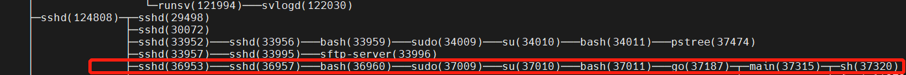
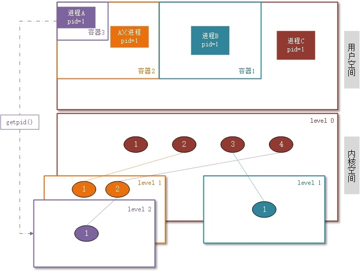
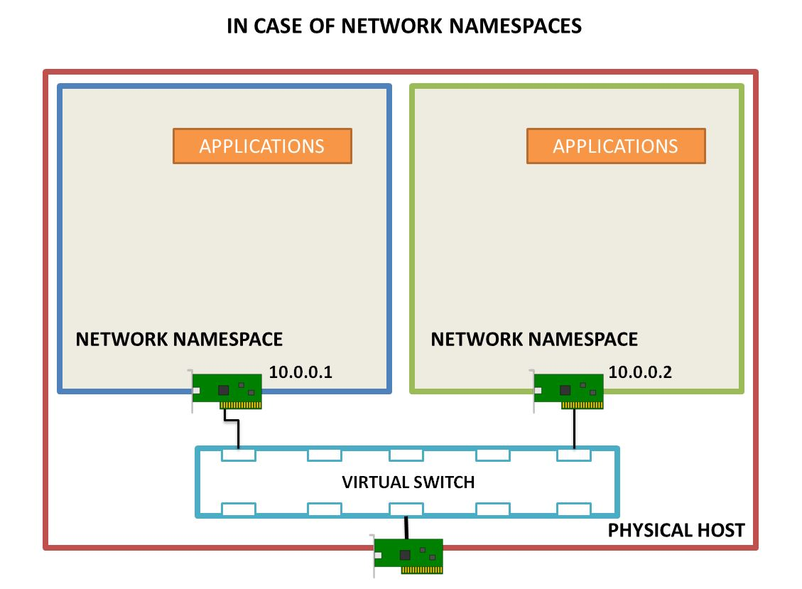
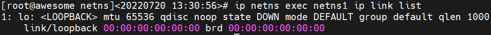
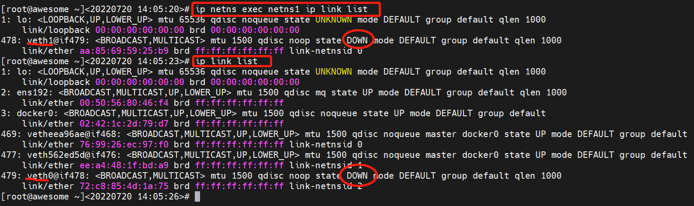
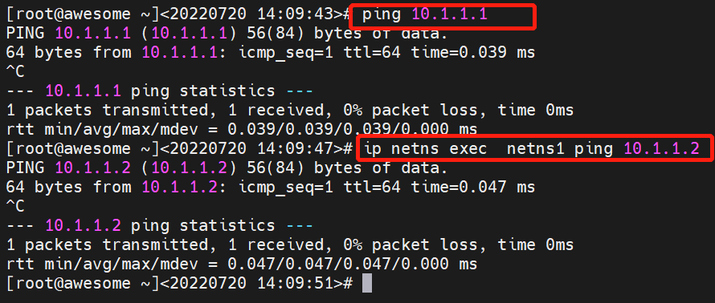

import { Highlight } from "@site/src/components/MyMDX"
import Tabs from '@theme/Tabs';
import TabItem from '@theme/TabItem';

<br/>
<br />

> ✨ 我们在上一节简单介绍了Docker涉及的6个Linux Namespace，这一节我将尝试着用几个生动的例子去揭开Namespace神秘的面纱


## Namespace 基本概念

Linux `Namespace` 是 Kernel 的一组功能，它可以隔离一些列的系统资源，比如`PID`(Process ID)、`User ID`、`Network` 等。
`Namespace` 可以在一些资源上，将进程隔离起来，这些资源包括但不限于进程树、网络接口、文件挂载点等。

:::tip
对Linux比较熟悉的人，可能很快就能想到`chroot`命令，它能将当前目录变成根目录一样
:::

比如，一家公司对外界出售其计算资源，公司有一台性能不错的服务器，每个用户都购买了一个tomcat实例，某些用户可能不小心进入了别人的tomcat实例并进行了相关变更，造成客户之间的干扰。也许你会说，给每个用户分配单独的账户，保证每个用户只能访问自己的实例，但是有些操作可能需要系统级别的权限，我们不可能给每个用户都进行root赋权，也不可能给每个实例一个单独的服务器进行部署。
因此，Namespace在这里就派上了用处，使用Namepspace可以实现UID级别的隔离，__也就是说给UID为n的用户虚拟出一个UID Namespace，在这个Namespace里面，用户是有这个命名空间的root权限的，但是在真实的物理机上，还还是那个UID为n的普通用户__。
这样，就能初步实现用户隔离的需求

除了User Namespace，PID也是可以被虚拟的。命名空间建立系统的不同视图，从用户的角度看来，每个命名空间就像一个单独的Linux计算机一样，有自己的init进程（PID==1），其他进程的PID依次递增，空间A和空间B都会存在PID为1的init进程，子命名空间的进程映射到父命名空间上，父命名空间可以知道每一个子命名空间的运行状态，子命名空间之间又是相互隔离的。


:::tip
如上图所示，子命名空间内的进程PID都是从init进程开始的，且每个子命名空间对其他命名空间是无感知的
:::

当前Docker技术所涉及的6个Namespace如下表

| namespace              | 引入的相关内核版本                                           | 被隔离的全局系统资源                                         | 在容器语境下的隔离效果                                       |
| ---------------------- | ------------------------------------------------------------ | ------------------------------------------------------------ | ------------------------------------------------------------ |
| **Mount namespaces**   | [Linux 2.4.19](http://lwn.net/2001/0301/a/namespaces.php3)   | 文件系统挂接点                                               | 每个容器能看到不同的文件系统层次结构                         |
| **UTS namespaces**     | [Linux 2.6.19](http://lwn.net/Articles/179345/)              | nodename 和 domainname                                       | 每个容器可以有自己的 hostname 和 domain name                 |
| **IPC namespaces**     | [Linux 2.6.19](http://lwn.net/Articles/187274/)              | 特定的进程间通信资源，包括[System V IPC](http://www.kernel.org/doc/man-pages/online/pages/man7/svipc.7.html) 和 [POSIX message queues](http://www.kernel.org/doc/man-pages/online/pages/man7/mq_overview.7.html) | 每个容器有其自己的 System V IPC 和 POSIX 消息队列文件系统，因此，只有在同一个 IPC namespace 的进程之间才能互相通信 |
| **PID namespaces**     | [Linux 2.6.24](http://lwn.net/Articles/259217/)              | 进程 ID 数字空间 （process ID number space）                 | 每个 PID namespace 中的进程可以有其独立的 PID； 每个容器可以有其 PID 为 1 的root 进程；也使得容器可以在不同的 host 之间迁移，因为 namespace 中的进程 ID 和 host 无关了。这也使得容器中的每个进程有两个PID：容器中的 PID 和 host 上的 PID。 |
| **Network namespaces** | [始于Linux 2.6.24 完成于 Linux 2.6.29](http://lwn.net/Articles/219794/) | 网络相关的系统资源                                           | 每个容器用有其独立的网络设备，IP 地址，IP 路由表，/proc/net 目录，端口号等等。这也使得一个 host 上多个容器内的同一个应用都绑定到各自容器的 80 端口上。 |
| **User namespaces**    | [始于 Linux 2.6.23 完成于 Linux 3.8)](http://lwn.net/Articles/528078/) | 用户和组 ID 空间                                             | 在 user namespace 中的进程的用户和组 ID 可以和在 host 上不同； 每个 container 可以有不同的 user 和 group id；一个 host 上的非特权用户可以成为 user namespace 中的特权用户； |

Namespace的API主要涉及如下三个系统调用

- [clone()](https://man7.org/linux/man-pages/man2/clone.2.html) 创建新进程。 根据系统调用参数来判断哪些类型的Namespace被创建，而且它们的子进程也会被包含到当前Namespace

    ```c
     int clone(int (*child_fn)(void *), void *child_stack, int flags, void *arg, ...
                     /* pid_t *parent_tid, void *tls, pid_t *child_tid */ );
   ```
   - **child_fn**: 指定一个由新进程执行的函数。当这个函数返回时，子进程终止。该函数返回一个整数，表示子进程的退出代码
   - **指针child_stack**： 传入子进程的栈空间，也就是把用户态堆栈信息赋给子进程的esp寄存器。调用进程（父进程）总是为子进程分配新的堆栈
   - **flags**：CLONE_*标志位
   - **args**: 用户自定义的参数
   

<details>
  <summary>六种CLONE_NEW标志</summary>
  <div>
    <div>         
    <p>CLONE_NEWIPC (since Linux 2.6.19)</p>
    <p>CLONE_NEWNET (since Linux 2.6.24)</p>
    <p>CLONE_NEWNS (since Linux 2.4.19)</p>
    <p>CLONE_NEWPID (since Linux 2.6.24)</p>
    <p>CLONE_NEWUSER</p>
    <p>CLONE_NEWUTS</p>
    </div>
    <br/>
  </div>
</details>

:::note
clone系统调用其实就是fork的延申函数。我们可以通过flag来控制特定的功能。clone总共有20多个标志来控制进程clone时的行为。例如是否与父进程共享虚拟内存、open files、信号处理等。
:::

-   [unshare()](https://man7.org/linux/man-pages/man2/unshare.2.html) 将进程移出某个命名空间

    ```c
     int unshare(int flags);
    ```

    -   其中：`flags`用于指定一个或者多个上面的CLONE_NEW*宏定义（当然也可以包含跟namespace无关的flags，多个flags 用|进行分隔），这样就会创建一个或多个新的不同类型的namespace，并把新创建的子进程加入新创建的这些namespace中。 clone和unshare的区别

        clone和unshare的功能都是创建并加入新的namespace， 他们的区别是：

        -   unshare是使当前进程加入新的namespace。
        -   clone是创建一个新的子进程，然后让子进程加入新的namespace，而当前进程保持不变。

-   [setns()](https://man7.org/linux/man-pages/man2/setns.2.html) 将进程加入到某个namespace

    ```c
    int setns(int fd, int nstype);
    ```

    -   **fd**：指向/proc/[pid]/ns/目录里相应namespace对应的文件，表示要加入哪个namespace
    -   **nstype**：指定namespace的类型（上面的任意一个CLONE_NEW*），具体分为两种情况：1. 如果当前进程不能根据fd得到它的类型，如fd由其他进程创建，并通过UNIX domain socket传给当前进程，那么就需要通过nstype来指定fd指向的namespace的类型。2. 如果进程能根据fd得到namespace类型，比如这个fd是由当前进程打开的，那么nstype设置为0即可。

## 📱UTS Namespace

### shell demo

 UTS(UNIX Time-Sharing System) namespace可隔离 `hostname` 和 `NIS Domain name`资源，使得一个宿主机可拥有多个主机名或Domain Name。换句话说，可让不同namespace中的进程看到不同的主机名。 

例如，使用unshare命令(较新版本Linux内核还支持nscreate命令)创建一个新的uts namespace：

```shell
$ hostname
niubility     # 当前root namespace的主机名为niubility
$ sudo unshare -u /bin/bash
[root@niubility dc2-user]            # 进入了新的namespace中的shell
                                     # 其主机名初始时也是niubility
                                     # 其拷贝自上级namespace资源
```

-   -u或--uts表示创建一个uts namespace，这个namespace中运行/bin/bash程序

因为是uts namespace，所以可在此namespace中修改主机名：

```shell
[root@niubility dc2-user]# hostname ns1
[root@niubility dc2-user]# hostname
ns1
[root@niubility dc2-user]# exec $SHELL
[root@ns1 dc2-user]#
```

namespace中修改的主机名不会直接修改主机名配置文件(如`/etc/hostname`)，而是修改内核属性`/proc/sys/kernel/hostname`：

```shell
[root@ns1 dc2-user]# cat /proc/sys/kernel/hostname
ns1
[root@ns1 dc2-user]# cat /etc/hostname
niubility
```

### go demo

:::caution 为什么用go语言演示
下面将使用`go`做一个例子，其实对于namespace这种系统调用，使用`c`语言来描述是最好的，但是这的目录是为了理解docker，由于`docker`就是`go`开发的，所以我们用`go`来进行讲解
:::


<details>
  <summary><Highlight color="#25c2a0">展开代码</Highlight></summary>


```go title="ust_ns_demo.go"
package main

import (
	"os/exec"
    "syscall"
    "os"
    "log"
)

func main() {
    cmd := exec.Command("sh")
    cmd.SysProcAttr = &syscall.SysProcAttr{
        Cloneflags: syscall.CLONE_NEWUTS,
    }
    cmd.Stdin = os.Stdin
    cmd.Stdout = os.Stdout
    cmd.Stderr = os.Stderr
    
    if err := cmd.Run(); err != nil {
        log.Fatal(err)
    }
}
```

</details>

-   `exec.Command("sh")`用来指定被`fork`出来的新进程的初始命令，等价于前面的`clone()`命令的*child_fn*

-   下面就是设置*flags*参数标志位为`CLONE_NEWUTS`，并使用这个标志去创建一个UTS_NAMESPACE
-   go实际上是帮我们封装了`clone()`这个函数
-   这段代码执行后就会进入到一个子进程的sh运行环境

来看下我们的运行环境

```shell
# uname -r
3.10.0-1062.el7.x86_64
# go version
go version go1.18.3 linux/amd64
```

我们运行起来这个程序，能得到一个交互式环境，在这个交互式环境里，使用`pstree-pl`查看以下系统进程之间的关系，如下



然后在这个程序里面查看当前sh的进程号

```shell
sh-4.2# echo $$
37320
```

然后我们继续验证一下父进程和子进程是否在不同的UTS Namespace 中， 验证方式就是去`/proc/PID/ns/uts`查看对应的uts是否一致

```shell
# readlink /proc/37011/ns/uts
uts:[4026531838]
# readlink /proc/37320/ns/uts
uts:[4026532797]
```

可以看到UTS确实是隔离的，不同的UTS对hostname做了隔离，我们修改子namespace内的hostname来验证下

```shell
sh-4.2# hostname -b demo
sh-4.2# hostname
#highlight-next-line
demo

// 切换到父namespace进行查看
# hostname
#highlight-next-line
awesome
```

:::warning 结论

由此验证，UTS确实是对hostname进行了隔离

:::

## 📱IPC Namespace

进程间通讯的机制称为 *IPC(Inter-Process Communication)*。Linux 下有多种 IPC 机制：*管道（PIPE）*、*命名管道（FIFO）*、*信号（Signal）*、*消息队列（Message queues）*、*信号量（Semaphore）*、*共享内存（Share Memory）*、*内存映射（Memory Map）*、*套接字（Socket）*。

其中的三种消息队列（Message queues）、信号量（Semaphore）、共享内存（Share Memory）被称为 XSI IPC，他们源自于 UNIX System V IPC。

Linux 的 IPC Namespace 主要就是针对 XSI IPC 的，和其他 IPC 机制无关。

我们用简单操作来熟悉一下 IPC Namespace 的概念：


我们在上一版的基础上稍微改动了一下代码


<details>
  <summary><Highlight color="#25c2a0">展开代码</Highlight></summary>


```go title=ipc_ns_demo.go
package main

import (
	"os/exec"
    "syscall"
    "os"
    "log"
)

func main() {
    cmd := exec.Command("sh")
    cmd.SysProcAttr = &syscall.SysProcAttr{
        //highlight-next-line
        Cloneflags: syscall.CLONE_NEWIPC,
    }
    cmd.Stdin = os.Stdin
    cmd.Stdout = os.Stdout
    cmd.Stderr = os.Stderr
    
    if err := cmd.Run(); err != nil {
        log.Fatal(err)
    }
}
```

</details>

:::tip
等价于我们仅仅是修改了clone()函数的flag参数
:::

我们需要打开两个shell来验证下IPC的隔离效果

-   首先我们在宿主机上打开一个shell，并查看现有的`ipc Message Queues`

    ```shell
    # ipcs -q

    ------ Message Queues --------
    key        msqid      owner      perms      used-bytes   messages
    ```

-   接下来我们再创建一个Message Queues

    ```shell
    # ipcmk -Q
    Message queue id: 0
    
    # 再次查看现有queues
    
    # ipcs -q
    
    ------ Message Queues --------
    key        msqid      owner      perms      used-bytes   messages
    0x93ae8e58 0          root       644        0            0
    ```

-    下面，我们再切换到另一个shell tty去操作

    ```shell
    # go run main.go
    sh-4.2# ipcs -q
    
    ------ Message Queues --------
    key        msqid      owner      perms      used-bytes   messages
    ```

:::warning 结论

由此验证，IPC确实是对IPC Namespace进行了隔离

:::

## 📱PID Namespace

**PID Namespace对进程PID重新标号，即不同的Namespace下的进程可以有同一个PID。**

内核为所有的PID Namespace维护了一个树状结构，最顶层的是系统初始化创建的，被称为Root Namespace，由它创建的新的PID Namespace成为它的Child namespace，原先的PID Namespace成为新创建的Parent Namespace，这种情况下不同的PID Namespace形成一个等级体系：父节点可以看到子节点中的进程，可以通过信号对子节点的进程产生影响，反过来子节点无法看到父节点PID Namespace里面的进程。下面用一个图描述容器、进程pid、pid namespace关系：



PID namesapce 对容器类应用特别重要， 可以实现容器内进程的暂停/恢复等功能，还可以支持容器在跨主机的迁移前后保持内部进程的 PID 不发生变化。


<details>
  <summary><b>pid namespace 特性</b></summary>
  <div>
    <div>        
    <ol>
    <li>进程所属的 PID namespace 在它创建的时候就确定了，不能更改，所以调用 unshare 和 nsenter 等命令后，原进程还是属于老的 PID namespace，新 fork 出来的进程才属于新的 PID namespace</li>
    <li>PID namespace 可以嵌套</li>
    <li>PID namespace 中的 init 进程。当一个进程的父进程退出后，该进程就变成了孤儿进程。孤儿进程会被当前 PID namespace 中 PID 为 1 的进程接管，而不是被最外层的系统级别的 init 进程接管</li>
    </ol>
    </div>
  </div>
</details>

在前面代码的基础上，我们再稍作改动


<details>
  <summary><Highlight color="#25c2a0">展开代码</Highlight></summary>


```go title=pid_ns_demo.go
package main

import (
	"os/exec"
    "syscall"
    "os"
    "log"
)

func main() {
    cmd := exec.Command("sh")
    cmd.SysProcAttr = &syscall.SysProcAttr{
        //highlight-next-line
        Cloneflags: syscall.CLONE_NEWIPC|syscall.CLONE_NEWUTS|syscall.CLONE_NEWPID,
    }
    cmd.Stdin = os.Stdin
    cmd.Stdout = os.Stdout
    cmd.Stderr = os.Stderr
    
    if err := cmd.Run(); err != nil {
        log.Fatal(err)
    }
}
```

</details>

我们运行go程序，能打印当前进程的`pid`

```shell
# go run main.go
64427
sh-4.2# echo $$
1
```

可以看到，这个进程的实际PID为`64427`， 但是在进程内实现了PID的隔离，它认为自己是`init`进程

:::caution
这里还不能使用	`ps` 来查看，因为 `ps` 和 `top` 等命令会使用 `/proc` 内容，具体在后面的mount namespace进行详细讲解
:::

## 📱Mount Namespace

>    用户通常使用`mount`命令来挂载普通文件系统，但实际上`mount`能挂载的东西非常多，甚至连现在功能完善的Linux系统，其内核的正常运行也都依赖于挂载功能，比如挂载根文件系统``/``。其实所有的挂载功能和挂载信息都由内核负责提供和维护，mount命令只是发起了`mount()`系统调用去请求内核。

mount namespace可隔离出一个具有独立挂载点信息的运行环境，内核知道如何去维护每个namespace的挂载点列表。即**每个namespace之间的挂载点列表是独立的，各自挂载互不影响**。

:::note
内核将每个进程的挂载点信息保存在`/proc/<pid>/{mountinfo,mounts,mountstats}`三个文件中：
:::

我们还是对上面的代码做一些改动


<details>
  <summary><Highlight color="#25c2a0">展开代码</Highlight></summary>

```go title=mount_ns_demo.go
package main

import (
	"os/exec"
    "syscall"
    "os"
    "log"
)

func main() {
    cmd := exec.Command("sh")
    cmd.SysProcAttr = &syscall.SysProcAttr{
        //highlight-next-line
        Cloneflags: syscall.CLONE_NEWIPC|syscall.CLONE_NEWUTS|syscall.CLONE_NEWPID|syscall.CLONE_NEWNS,
    }
    cmd.Stdin = os.Stdin
    cmd.Stdout = os.Stdout
    cmd.Stderr = os.Stderr
    
    if err := cmd.Run(); err != nil {
        log.Fatal(err)
    }
}
```

</details>

:::note <Highlight color="#40E0D0">历史趣闻</Highlight>
Mount Namespace是Linux第一个实现的Namespace类型，它的系统调用参数为NEWNS(NEW Namespace)。
<Highlight color="#DDA0DD">当时人们貌似没有意识到，以后还会有很多类型的Namespace加入Linux大家庭</Highlight> 
:::

首先运行代码，然后查看一下`/proc` 文件内容。 `proc` 是一个文件系统，提供额外的机制，可以通过内核和内核模块将信息发送给进程。

```shell
[root@awesome ~]<20220720 11:18:36># ll /proc/
total 0
dr-xr-xr-x  9 root    root                  0 Dec  7  2021 1
dr-xr-xr-x  9 root    root                  0 Jul  4 08:14 10
dr-xr-xr-x  9 root    root                  0 Jul  4 08:14 10111
dr-xr-xr-x  9 root    root                  0 Jul  4 08:14 10189
dr-xr-xr-x  9 root    root                  0 Jul  4 08:14 1025
dr-xr-xr-x  9 polkitd polkitd               0 Jul  4 08:14 103844
dr-xr-xr-x  9 root    root                  0 Jul  4 08:14 103874
dr-xr-xr-x  9 root    root                  0 Jul  4 08:14 1045
dr-xr-xr-x  9 root    root                  0 Jul  4 08:14 105
dr-xr-xr-x  9 root    root                  0 Jul  4 08:14 10532
dr-xr-xr-x  9 root    root                  0 Jul  4 08:14 106
dr-xr-xr-x  9 root    root                  0 Jul  4 08:14 107
dr-xr-xr-x  9 root    root                  0 Jul 18 04:10 1070
dr-xr-xr-x  9 root    root                  0 Jul  4 08:14 10709
dr-xr-xr-x  9 root    root                  0 Jul  4 08:14 108
dr-xr-xr-x  9 root    root                  0 Jul  4 08:14 11
...
```

因为这里的 `/proc `还是宿主机的，看到里面会比较乱，下面将`/proc` mount 到我们自己的namespace下面

```shell
sh-4.2# mount -t proc proc /proc
sh-4.2# ls /proc/
1          bus       cpuinfo    dma          filesystems  ioports   keys        kpageflags  meminfo  mtrr          sched_debug  slabinfo  sys            timer_stats  vmallocinfo
40         cgroups   crypto     driver       fs           irq       key-users   loadavg     misc     net           schedstat    softirqs  sysrq-trigger  tty          vmstat
acpi       cmdline   devices    execdomains  interrupts   kallsyms  kmsg        locks       modules  pagetypeinfo  scsi         stat      sysvipc        uptime       zoneinfo
buddyinfo  consoles  diskstats  fb           iomem        kcore     kpagecount  mdstat      mounts   partitions    self         swaps     timer_list     version
```

可以看到少了很多文件，我们现在就可以用`ps`来查看系统的进程了

```shell
sh-4.2# ps -ef
UID        PID  PPID  C STIME TTY          TIME CMD
root         1     0  0 11:18 pts/1    00:00:00 sh
root        53     1  0 11:22 pts/1    00:00:00 ps -ef
```


:::warning 结论
在当前namespace中，sh进程是PID为1的进程，这就说明，当前的Mount Namespace中的mount和外部空间是隔离的，mount操作并没有影响到外部。docker的volume也是利用了这个特性
:::


## 📱User Namespace

user namespace 主要隔离了安全相关的标识符和属性，包括用户 ID，用户组 ID，key 和 capabilities 等。同样一个用户 id 在不同 user namespace 中会有不同的权限。比如，进程属于一个普通用户，但是它创建的 user namespace 却属于拥有所有权限的超级用户。

从Linux Kernel 3.8开始，非root进程也可以创建User Namespace，并且此用户在Namespace里可以被映射成root，且在Namespace内具有root权限

下面，继续使用一个例子进行演示


<details>
  <summary><Highlight color="#25c2a0">展开代码</Highlight></summary>

```go title=user_ns_demo.go
package main

import (
	"log"
	"os"
	"os/exec"
	"syscall"
)

func main() {
	cmd := exec.Command("sh")
	cmd.SysProcAttr = &syscall.SysProcAttr{
		//highlight-next-line
		Cloneflags: syscall.CLONE_NEWIPC | syscall.CLONE_NEWUTS | syscall.CLONE_NEWPID | syscall.CLONE_NEWNS | syscall.CLONE_NEWUSER,
		//UidMappings: []syscall.SysProcIDMap{
		//	{
		//		ContainerID: 1234,
		//		HostID:      0,
		//		Size:        1,
		//	},
		//},
		//GidMappings: []syscall.SysProcIDMap{
		//	{ContainerID: 1234,
		//		HostID: 0,
		//		Size:   1,
		//	},
		//},
	}
	//highlight-next-line
	// cmd.SysProcAttr.Credential = &syscall.Credential{Uid: uint32(1), Gid: uint32(1)}

	cmd.Stdin = os.Stdin
	cmd.Stdout = os.Stdout
	cmd.Stderr = os.Stderr

	if err := cmd.Run(); err != nil {
		log.Fatal(err)
	}
	//highlight-next-line
	os.Exit(-1)
}
```


</details>


首先，以root用户来运行这个程序，运行前我们先查看下当前的`uid`和`gid`

```shell
# id
uid=0(root) gid=0(root) groups=0(root)
```

可以看到我们是 root 户，接下来运行一下程序

```shell
# go run main.go
sh-4.2$ id
uid=65534(nfsnobody) gid=65534(nfsnobody) groups=65534(nfsnobody)
```

可以看到 它们的 uid是不同的 ，因此说明 User Namespace 生效了

:::warning

centos默认是不开启UserNamepsace的，如果不开启会报以下错误

```shell
# go run main.go
... fork/exec /bin/sh: invalid argument
exit status 1
```

我们需要手动开启

```shell
# echo 640 > /proc/sys/user/max_user_namespaces
```

:::

## 📱Newwork Namespace

<Highlight color="#FF1493">网络问题是最复杂的，我们在这里要着重花一些篇幅来详细阐述</Highlight>

network namespace，它在Linux内核2.6版本引入，作用是隔离Linux系统的设备，以及IP地址、端口、路由表、防火墙规则等网络资源。因此，每个网络namespace里都有自己的网络设备（如IP地址、路由表、端口范围、`/proc/net`目录等）。

从网络的角度看，network namespace使得容器非常有用，一个直观的例子就是：由于每个容器都有自己的虚拟网络设备，并且容器里的进程可以放心的绑定在端口上而2不必担心冲突，这就使得一个主机上同时运行多个监听80端口的Web'服务器变为可能。



### netns

network namespace的增删改查功能已经集成到Linux的ip工具的`netns`子命令中，因此大大降低了初学者的体验门槛。下面先介绍几条简单的网络namespace管理的命令

创建一个名为netns1的network namespace可以使用一下命令：

```shell
# ip netns add netns1
```

当`ip`命令创建了一个network namespace时，系统会在`/var/run/netns`路径下面生成一个**挂载点**。挂载点的作用一方面是方便对namespace的管理，另一方面是使namespace即使没有进程运行也能继续存在。

```shell
# cd /var/run/netns/
# pwd
/var/run/netns
# ls
#highlight-next-line
netns1
```

一个networknamespace被创建出来后，可以使用ip netns exec命令进入，做一些网络查询/配置的工作。



如上所示，就是进入netns1这个network namespace查询网卡信息的命令。目前，我们没有任何配置，因此只有一块系统默认的本地回环设备`lo`

想查看系统中有哪些network namespace，可以使用以下命令：

```shell
# ip netns list
netns1
```

想删除networknamespace，可以通过以下命令实现：

```shell
# ip netns delete ns_name
```

:::caution 注意
这条命令实际上并没有删除`netns1`这个network namespace，它只是移除了这个network namespace对应的挂载点（下文会解释）。只要里面还有进程运行着，networknamespace便会一直存在。
:::

### 配置Network Namespase

当namespace里面的进程涉及网络通信时，namespace里面的（虚拟）网络设备就必不可少了。我们已经知道，一个全新的network namespace会附带创建一个本地回环地址。除此之外，没有任何其他的网络设备。而且，network namespace自带的lo设备状态还是<Highlight color="#DC143C">DOWN</Highlight>的，因此，当尝试访问本地回环地址时，网络也是不通的。下面的小测试就说明了这一点。

```shell
# ip netns exec netns1 ping 127.0.0.1
#highlight-next-line
connect: Network is unreachable
```

如果想访问本地回环地址，首先需要进入netns1这个network namespace，把设备状态设置成<Highlight color="#7FFFD4">UP</Highlight>。

```shell
# ip netns exec netns1 ip link set dev lo up
```

然后，尝试ping127.0.0.1，发现能够ping通。

```shell
# ip netns exec netns1 ping 127.0.0.1
PING 127.0.0.1 (127.0.0.1) 56(84) bytes of data.
64 bytes from 127.0.0.1: icmp_seq=1 ttl=64 time=0.037 ms
^C
--- 127.0.0.1 ping statistics ---
1 packets transmitted, 1 received, 0% packet loss, time 0ms
```

但是，仅有一个本地回环设备是没法与外界通信的。如果我们想与外界（**比如主机上的网卡**）进行通信，就需要在namespace里再创建一对虚拟的以太网卡，即所谓的`veth pair`。顾名思义，`veth pair`总是成对出现且相互连接，它就像Linux的双向管道（`pipe`），报文从`veth pair`一端进去就会由另一端收到。

下面的命令将创建一对虚拟以太网卡，然后把vethpair的一端放到netns1 network namespace。

```shell
# ip link add veth0 type veth peer name veth1
# ip link set veth1 netns netns1
```

我们创建了`veth0`和`veth1`这么一对虚拟以太网卡。在默认情况下，它们都在主机的根network namespce中，将其中一块虚拟网卡`veth1`通过`ip link set`命令移动到netns1 network namespace。


<details>
  <summary><b>那么，veth0和veth1之间能直接通信吗？</b></summary>

还不能，因为这两块网卡刚创建出来还都是DOWN状态，如下所示：
```shell
# ip netns exec netns1 ip link list
1: lo: <LOOPBACK,UP,LOWER_UP> mtu 65536 qdisc noqueue state UNKNOWN mode DEFAULT group default qlen 1000
    link/loopback 00:00:00:00:00:00 brd 00:00:00:00:00:00
478: veth1@if479: <BROADCAST,MULTICAST> mtu 1500 qdisc noop state DOWN mode DEFAULT group default qlen 1000
    link/ether aa:85:69:59:25:b9 brd ff:ff:ff:ff:ff:ff link-netnsid 0
```



需要手动把状态设置成UP。这个步骤的操作和上文对lo网卡的操作类似，只是多了一步绑定IP地址，如下所示：

```shell
# ip netns exec netns1 ifconfig veth1 10.1.1.1/24 up
# ifconfig veth0 10.1.1.2/24 up
```

上面两条命令首先进入`netns1`这个network namespace，为`veth1`绑定IP地址`10.1.1.1/24`，并把网卡的状态设置成`UP`，然后在主机根network namespace中的网卡`veth0`被我们绑定了IP地址`10.1.1.2/24`。这样一来，我们就可以ping通`veth pair`的任意一头了。



</details>


另外，不同network namespace之间的路由表和防火墙规则等也是隔离的，因此我们刚刚创建的netns1 network namespace没法和主机共享路由表和防火墙，这一点通过下面的测试就能说明。

```shell
# ip netns exec netns1 route
#highlight-start
Kernel IP routing table
Destination     Gateway         Genmask         Flags Metric Ref    Use Iface
10.1.1.0        0.0.0.0         255.255.255.0   U     0      0        0 veth1
#highlight-end

# ip netns exec netns1 iptables -L
#highlight-start
Chain INPUT (policy ACCEPT)
target     prot opt source               destination

Chain FORWARD (policy ACCEPT)
target     prot opt source               destination

Chain OUTPUT (policy ACCEPT)
target     prot opt source               destination
#highlight-end
```

我们进入netns1 network namespace，分别输入`route`和`iptables`命令，期望查询路由表和`iptables`规则，却发现**空空如也**。这意味着从netns1 network namespace发包到因特网也是徒劳的，因为网络还不通！想连接因特网，有若干解决方法。

-   例如，可以在主机的根network namespace创建一个Linux**网桥**并绑定`veth pair`的一端到网桥上
-   也可以通过适当的NAT（网络地址转换）规则并辅以Linux的`IP`转发功能（配置`net.ipv4.ip_forward=1`）

:::info 提示
用户可以随意将虚拟网络设备分配到自定义的network namespace里，而连接真实硬件的物理设备则只能放在系统的根network namesapce中。并且，<Highlight color="#00DD77">任何一个网络设备最多只能存在于一个network namespace中</Highlight>
:::

-   进程可以通过Linux系统调用`clone()`、`unshare()` 和 `setns()` 进入network namespace
-   非root进程被分配到network namespace后只能访问和配置已经存在于该network namespace的设备
-   当然，root进程可以在network namespace里创建新的网络设备
-   除此之外，network namespace里的root进程还能把本network namespace的虚拟网络设备分配到其他network namespace
    -   这个操作路径可以从主机的根network namespace到用户自定义network namespace，反之亦可

```shell
# ip netns exec netns1 ip link set veth1 netns 1

# ip netns exec netns1 ip a
#highlight-start
1: lo: <LOOPBACK,UP,LOWER_UP> mtu 65536 qdisc noqueue state UNKNOWN group default qlen 1000
    link/loopback 00:00:00:00:00:00 brd 00:00:00:00:00:00
    inet 127.0.0.1/8 scope host lo
       valid_lft forever preferred_lft forever
    inet6 ::1/128 scope host
       valid_lft forever preferred_lft forever
#highlight-end

# ip a|grep veth1
#highlight-start
478: veth1@veth0: <BROADCAST,MULTICAST> mtu 1500 qdisc noop state DOWN group default qlen 1000
479: veth0@veth1: <NO-CARRIER,BROADCAST,MULTICAST,UP,M-DOWN> mtu 1500 qdisc noqueue state LOWERLAYERDOWN group default qlen 1000
#highlight-end
```

该怎么理解上面这条看似有点复杂的命令呢？分解成两部分：

1.  `ip netns exec netns1`进入netns1 network namespace。
2.  `ip link set veth1 netns 1`把netns1 network namespace下的`veth1`网卡挪到`PID`为`1`的进程（即init进程）所在的network namespace。

通常，init进程都在主机的根network namespace下运行，因此上面这条命令其实就是把`veth1`从netns1 network namespace移动到系统根network namespace。

有两种途径索引network namespace：**名字**（例如netns1）或者属于该namespace的**进程PID**。上面用的是后者。

:::info 小结
对namespace的root用户而言，他们都可以把其namespace里的虚拟网络设备移动到其他network namespace，甚至包括主机根network namespace！这就带来了潜在的安全风险。如果用户希望屏蔽这一行为，则需要结合PID namespace和Mount namespace的隔离特性做到network namespace之间的完全不可达。

通过Linux的network namespace技术可以自定义一个独立的网络栈，简单到只有loopback设备，复杂到具备系统完整的网络能力，这就使得network namespace成为Linux网络虚拟化技术的基石——不论是虚拟机还是容器时代。network namespace的另一个隔离功能在于，系统管理员一旦禁用namespace中的网络设备，即使里面的进程拿到了一些系统特权，也无法和外界通信。最后，网络对安全较为敏感，即使network namespace能够提供网络资源隔离的机制，用户还是会结合其他类型的namespace一起使用，以提供更好的安全隔离能力。
:::

### go demo

同样，前面的代码的基础上增加 `syscall.CLONE_NEWNET `标识符，如下


<details>
  <summary><Highlight color="#25c2a0">展开代码</Highlight></summary>

```go title=user_ns_demo.go
package main

import (
	"log"
	"os"
	"os/exec"
	"syscall"
)

func main() {
	cmd := exec.Command("sh")
	cmd.SysProcAttr = &syscall.SysProcAttr{
		//highlight-next-line
		Cloneflags: syscall.CLONE_NEWIPC | syscall.CLONE_NEWUTS | syscall.CLONE_NEWPID | syscall.CLONE_NEWNS | syscall.CLONE_NEWUSER | syscall.CLONE_NEWNET,
	}
	//highlight-next-line
	// cmd.SysProcAttr.Credential = &syscall.Credential{Uid: uint32(1), Gid: uint32(1)}

	cmd.Stdin = os.Stdin
	cmd.Stdout = os.Stdout
	cmd.Stderr = os.Stderr

	if err := cmd.Run(); err != nil {
		log.Fatal(err)
	}
	//highlight-next-line
	os.Exit(-1)
}
```


</details>

我们运行之后来查看对应的网卡

```shell
# go run main.go
sh-4.2$ ifconfig
sh-4.2$
```

我们发现在Namespace里面什么网卡也没有，这样就能断定network的隔离能力了


```
name: Deploy to GitHub Pages

on:
  push:
    branches:
      - master
    # 如果你想要进一步定义触发条件、路径等，可以查看文档
    # https://docs.github.com/en/actions/using-workflows/workflow-syntax-for-github-actions#on
defaults:
  run:
    shell: bash
    working-directory: yuanyp8-dochub
jobs:
  deploy:
    name: Deploy to GitHub Pages
    runs-on: ubuntu-latest
    steps:
      - uses: actions/checkout@v2
      - uses: actions/setup-node@v3
        with:
          node-version: 18
          cache: npm

      - name: Install dependencies
        run: npm ci
      - name: Build website
        run: npm run build

      # 部署到 GitHub Pages 的热门选择：
      # 文档：https://github.com/peaceiris/actions-gh-pages#%EF%B8%8F-docusaurus
      - name: Deploy to GitHub Pages
        uses: peaceiris/actions-gh-pages@v3
        with:
          github_token: ${{ secrets.GITHUB_TOKEN }}
          # 要发布到 `gh-pages` 分支的构建输出：
          publish_dir: ./build
          # 下面两行会将此次部署 commit 的作者设置为官方的
          # GH-Actions 机器人：
          # https://github.com/actions/checkout/issues/13#issuecomment-724415212
          # 如果不设置这两个字段，GH actions 机器人会被默认使用。
          # 你可以用自己的用户信息替换它们。
          user_name: github-actions[bot]
          user_email: 41898282+github-actions[bot]@users.noreply.github.com
```

