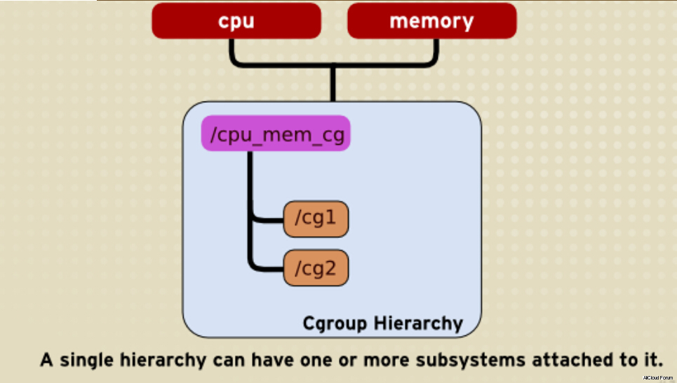

import { Highlight } from "@site/src/components/MyMDX"
import Tabs from '@theme/Tabs';
import TabItem from '@theme/TabItem';

<br/>
<br />

> ✨ 我们在上一节介绍了进程隔离的主要实现--Linux Namespace, 接下来我们讲一下进程的资源隔离与资源限制是如何实现的


## Cgroup 简介
Linux CGroup全称`Linux Control Group`， 是Linux内核的一个功能，用来限制，控制与分离一个进程组群的资源（如CPU、内存、磁盘输入输出等）。这个项目最早是由`Google`的工程师在`2006`年发起（主要是Paul Menage和Rohit Seth），最早的名称为进程容器（`process containers`）。
在2007年时，因为在Linux内核中，容器（container）这个名词太过广泛，为避免混乱，被重命名为`cgroup`，并且被合并到`2.6.24`版的内核中去。然后开始了它的发展。

Linux CGroupCgroup 可让您为系统中所运行任务（进程）的用户定义组群分配资源 — 比如 CPU 时间、系统内存、网络带宽或者这些资源的组合。您可以监控您配置的 cgroup，拒绝 cgroup 访问某些资源，甚至在运行的系统中动态配置您的 cgroup。

cgroups 适用于多种应用场景，从单个进程的资源控制，到实现操作系统层次的虚拟化（OS Level Virtualization）。 Cgroups 提供了以下功能：
1. 限制进程组可以使用的资源数量（Resource limiting ）。比如：memory子系统可以为进程组设定一个memory使用上限，一旦进程组使用的内存达到限额再申请内存，就会出发OOM（out of memory）。
2. 进程组的优先级控制（Prioritization ）。比如：可以使用cpu子系统为某个进程组分配特定cpu share。
3. 记录进程组使用的资源数量（Accounting ）。比如：可以使用cpuacct子系统记录某个进程组使用的cpu时间
4. 进程组隔离（Isolation）。比如：使用ns子系统可以使不同的进程组使用不同的namespace，以达到隔离的目的，不同的进程组有各自的进程、网络、文件系统挂载空间。

## Cgroups相关概念及其关系

1. **任务（task）**-  在cgroups中，任务就是系统的一个进程。

2. **控制族群（control group） **-  控制族群就是一组按照某种标准划分的进程。Cgroups中的资源控制都是以控制族群为单位实现。一个进程可以加入到某个控制族群，也可以从一个进程组迁移到另一个控制族群。一个进程组的进程可以使用cgroups以控制族群为单位分配的资源，同时受到cgroups以控制族群为单位设定的限制。

3. **层级（hierarchy）**-  hierarchy的功能是把一组cgroup串成一个树状的结构，一个这样的树便是一个hierarchy，通过这种树状的结构，Cgroups可以做到继承。

:::info
比如我的系统对一组定时的任务进程通过cgroup1限制了CPU的使用率，然后其中有一个定时dump日志的进程还需要限制磁盘IO，为了避免限制了影响到其他进程，就可以创建cgroup2继承于cgroup1并限制磁盘的IO，这样cgroup2便继承了cgroup1中的CPU的限制，并且又增加了磁盘IO的限制而不影响到cgroup1中的其他进程。
:::

4. **子系统（subsytem）**-  一个子系统就是一个资源控制器，比如cpu子系统就是控制cpu时间分配的一个控制器。子系统必须附加（attach）到一个层级上才能起作用，一个子系统附加到某个层级以后，这个层级上的所有控制族群都受到这个子系统的控制。
    1. blkio 设置对块设备（比如硬盘）输入输出的访问控制
    2. cpu 设置 cgroup 中进程的 CPU 被调度的策略。
    3. cpuacct 可以统计 cgroup 中进程的 CPU 占用
    4. cpuset 在多核机器上设置 cgroup 中进程可以使用的 CPU 和内存（此处内存仅使用于NUMA 架构）
    5. devices 控制 cgroup 中进程对设备的访问
    6. freezer 用于挂起（ suspend ）和恢复（ resume) cgroup 中的进程
    7. memory 用于控制 cgroup 中进程的内存占用
    8. net_els 用于将 cgroup 中进程产生的网络包分类，以便 Linux tc (traffic con oller ）可以根据分类区分出来自某个 cgroup 的包并做限流或监控
    9. net_prio 设置 cgroup 中进程产生的网络流量的优先级
    10. ns 这个 subsystem 比较特殊，它的作用是使 cgroup 中的进程在新的 Namespace fork新进程 CNEWNS ）时，创建出 个新的 cgroup ，这个 cgroup 包含新的 Namespace
        的进程

每个 subsystem 会关联到定义了相应限制的 cgroup 上，并对这个 cgroup 中的进程做相应的限制和控制。

这些subsystem是逐步添加合并到内核中的，我们可以安装相关的工具来查看当前内核支持哪些subsystem

:::note cgroup-bin工具的安装

<Tabs>
  <TabItem value="Centos安装方式" label="Centos安装方式" default>

```shell
# yum install libcgroup libcgroup-tools
```

  </TabItem>
  <TabItem value="Ubuntu安装方式" label="Ubuntu安装方式"> 

```shell
# apt-get install cgroup-bin
```

  </TabItem>

</Tabs>


然后通过`lssubsys`来查看当前kernel支持的subsystem版本
```shell
# lssubsys -a
cpuset
cpu,cpuacct
blkio
memory
devices
freezer
net_cls,net_prio
perf_event
hugetlb
pids
rdma
```

:::


### subsystem、cgroup、hierarchy三者关系

通过上面的组件的描述我们就不难看出，Cgroups的是靠这三个组件的相互协作实现的，那么这三个组件是什么关系呢？ 

-   系统在创建新的hierarchy之后，系统中所有的进程都会加入到这个hierarchy的根cgroup节点中，这个cgroup根节点是hierarchy默认创建，后面在这个hierarchy中创建cgroup都是这个根cgroup节点的子节点。
-   一个subsystem只能附加到一个hierarchy上面
-   一个hierarchy可以附加多个subsystem
-   一个进程可以作为多个cgroup的成员，但是这些cgroup必须是在不同的hierarchy中
-   一个进程fork出子进程的时候，子进程是和父进程在同一个cgroup中的，也可以根据需要将其移动到其他的cgroup中。

:::warning
这几句话现在不理解暂时没关系，后面我们实际使用过程中会逐渐的了解到他们之间的联系的S
:::



在上图中，CPU 和 Memory subsystem子系统被附加到 cpu_mem_cg 的hierarchy中，其中 cg1 和 cg2 是两个 Control Group。但我们需要注意的是，如果 CPU 或 Memory 子系统附加到另一个层次结构中，则 CPU 或 Memory 子系统不能附加到 CPU 或 Memory 子系统。

 