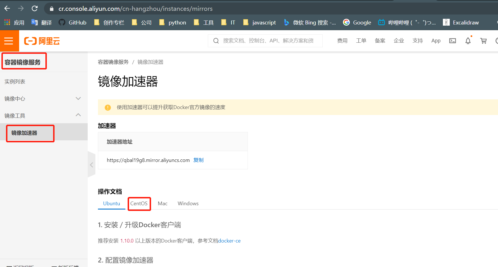

import { Highlight } from "@site/src/components/MyMDX"
import Tabs from '@theme/Tabs';
import TabItem from '@theme/TabItem';


## 支持安装的平台

### Desktop

<Tabs>
  <TabItem value="Windows" label="Windows" default>

[](https://docs.docker.com/desktop/install/windows-install/)

  </TabItem>
  <TabItem value="Mac" label="Mac"> 

[](https://docs.docker.com/get-docker/)

  </TabItem>
  <TabItem value="Linux" label="Linux">

[](https://docs.docker.com/desktop/install/linux-install/)

  </TabItem>
</Tabs>

### Server

安装Docker有如下要求:

-   Docker只支持`64`位CPU架构的计算机，目前不支持`32`位CPU；
-   建议系统的Linux内核版本为`3.10`及以上；
-   Linux内核需开启`cgroups`和`namespace`功能；

## 安装Docker

### Windwos安装Docker

直接参考官方教程即可，这里不单独展开描述

>   Desktop安装方式: https://docs.docker.com/docker-for-windows/install/

### CentOS安装Docker

#### 卸载旧版本

```shell title="uninstall old docker version"
$ sudo yum remove docker \
                 docker-client \
                  docker-client-latest \
                  docker-common \
                  docker-latest \
                  docker-latest-logrotate \
                  docker-logrotate \
                  docker-engine
```

#### 配置Docker的yum下载源

```shell title="add docker yum repo"
$ sudo yum install -y yum-utils

$ sudo yum-config-manager \
               --add-repo \
               https://download.docker.com/linux/centos/docker-ce.repo
```

#### 安装Docker容器引擎

```shell title="install docker engine"
$ sudo yum install docker-ce docker-ce-cli containerd.io
```

#### 检查是否安装成功

```shell title="check if successd"
$ yum list docker-ce --showduplicates | sort -r

docker-ce.x86_64  3:18.09.1-3.el7                     docker-ce-stable
docker-ce.x86_64  3:18.09.0-3.el7                     docker-ce-stable
docker-ce.x86_64  18.06.1.ce-3.el7                    docker-ce-stable
docker-ce.x86_64  18.06.0.ce-3.el7                    docker-ce-stable
```

## 生产环境Docker优化

在实际使用过程中，仍然需要一些额外的参数配置来保证你的Docker更更加稳定

### Docker镜像仓库加速器

对于Docker官方镜像仓库Registry，没有**仓库镜像加速**，寸步难行。

镜像仓库加速器Registry Mirrors，是国内对官方Registry的”镜像(mirror)”，当拉取`image`时，Docker Daemon先去 Registry Mirrors 拉取镜像，如果没找到镜像，Registry Mirrors找官方Registry拉去镜像，然后再返回给本地。



**Registry Mirror设置**

针对Docker客户端版本大于 1.10.0 的用户，您可以通过修改daemon配置文件`/etc/docker/daemon.json`来使用加速器Docker镜像加速

```shell title="Docker镜像加速"
sudo mkdir -p /etc/docker
sudo tee /etc/docker/daemon.json <<-'EOF'
{
#highlight-next-line
"registry-mirrors": ["https://you-correct-address.mirror.aliyuncs.com"]
}
EOF

sudo systemctl daemon-reload
sudo systemctl restart docker

sudo mkdir -p /etc/docker
sudo tee /etc/docker/daemon.json <<-'EOF'
{
#highlight-next-line
"registry-mirrors": ["https://you-correct-address.mirror.aliyuncs.com"]
}
EOF

sudo systemctl daemon-reload
sudo systemctl restart docker
```

### Docker daemon重载

默认情况下，当 Docker守护进程终止时，它将关闭正在运行的容器。您可以配置守护程序，以便容器在守护程序不可用时保持运行。 此功能称为live-restore。live-restore选项有助于减少由于守护进程崩溃、计划中断或升级而导致的容器停机时间。

在工作中，假如修改了docker的配置而需要重新加载docker守护进程，导致docker容器重启，业务会中断一会，尤其是在生产环境，存在一定的风险。 这种情况下，可以启用live-restore功能，以在守护进程不可用时使容器保持活动状态。

将配置添加到守护进程配置，即`docker-daemon.json`，如下


```shell title="Docker守护进程重载"
$ cat /etc/docker/daemon.json
{
  "debug": false,
#highlight-next-line
  "registry-mirrors": ["https://you-correct-address.mirror.aliyuncs.com"],
  "live-restore": true
}
```

### Docker Logging Driver

Docker拥有多种日志机制来收集容器及其内部运行的服务的日志信息，这些机制统称为logging drivers。 Docker daemon 拥有一个默认的logging driver(json-file)，容器默认采用这个logging driver.

Docker处理日志的方法是 Docker daemon捕捉每一个容器进程的STDOUT和STDERR, 通过logging driver将它们输出保存在磁盘上。 然后用户就能使用docker logs 来进行查询。

这些日志跟随容器而产生的，如果删除了某个容器，相应的日志文件也会随着被删除。

Docker的默认 logging driver是 json-file

```shell
$ docker info | grep 'Logging Driver'
Logging Driver: json-file
```

除了 json-file 还支持很多 logging driver

| 驱动程序   | 描述                                                         |
| ---------- | ------------------------------------------------------------ |
| none       | 容器没有日志可用，docker logs 什么都不返回                   |
| local      | 日志以自定义格式存储，设计这种格式的目的是将开销降到最低。   |
| syslog     | 将日志消息写入 syslog 工具，syslog 守护程序必须在主机上运行。 |
| journald   | 将日志消息写入 journald，journald 守护程序必须在主机上运行。 |
| gelf       | 将日志消息写入 Graylog Extended Log Format (GELF) 终端，例如 Graylog 或 Logstash。 |
| fluentd    | 将日志消息写入 fluentd（forward input），fluentd 守护程序必须在主机上运行。 |
| awslogs    | 将日志消息写入 Amazon CloudWatch Logs。                      |
| splunk     | 使用HTTP事件收集器将日志消息写入splunk。                     |
| etwlogs    | 将日志消息写为 Windows 的 Event Tracing 事件，仅在Windows平台上可用。 |
| gcplogs    | 将日志消息写入 Google Cloud Platform (GCP) Logging。         |
| logentries | 将日志消息写入 Rapid7 Logentries。                           |
| json-file  | 日志格式化为 JSON，这是 Docker 默认的日志驱动程序。          |

-   none 是 disable 容器日志功能
-   syslog 和 journald 是linux上的两种日志管理服务
-   awslogs，splunk 和 gcplogs 是第三方日志托管服务
-   gelf 和 fluentd 是两种开源的日志管理方案

这里暂时演示默认的json-file配置


```shell title="Docker Logging Driver"
$ cat /etc/docker/daemon.json

{
  "debug": false,
#highlight-next-line
  "registry-mirrors": ["https://you-correct-address.mirror.aliyuncs.com"],
  "live-restore": true,
#highlight-next-line
  "log-driver": "json-file",
  "log-level": "warn",
#highlight-next-line
  "log-opts": {
    "max-file": "10",
    "max-size": "100m"
  }
}
```

### 开启iptable转发

iptable forward转发实现 `docker -p` 功能共局域网内其他主机访问

Linux系统缺省并没有打开IP转发功能，要确认IP转发功能的状态，可以查看/proc文件系统，使用下面命令

```shell
$ cat /proc/sys/net/ipv4/ip_forward
#highlight-next-line
0
```

-   如果上述文件中的值为`0`,说明禁止进行IP转发

-   如果是`1`,则说明IP转发功能已经打开

-   要想打开IP转发功能，可以直接修改上述文件： 

    ```shell
    echo 1 > /proc/sys/net/ipv4/ip_forward
    ```

    把文件的内容由0修改为1。禁用IP转发则把`1`改为`0`。

:::warning
上面的命令并没有保存对IP转发配置的更改，下次系统启动时仍会使用原来的值，
:::

要想永久修改IP转发，需要修改`/etc/sysctl.conf`文件，修 改下面一行的值： `net.ipv4.ip_forward = 1`

修改后可以重启系统来使修改生效，也可以执行下面的命令来使修改生效：

```shell
sysctl -p /etc/sysctl.conf
```

进行了上面的配置后，IP转发功能就永久使能了。

当然，我们也可以通过控制Docker Daemon配置文件来实现

_Docker iptables forwarding_

```shell
$ cat /etc/docker/daemon.json

{
 "debug": false,
 "registry-mirrors": ["https://you-correct-address.mirror.aliyuncs.com"],
 "live-restore": true,
 "log-driver": "json-file",
 "log-level": "warn",
 "log-opts": {
   "max-file": "10",
   "max-size": "100m"
},
#highlight-next-line
"ip-forward": true
}
```

<details>
  <summary><Highlight color="#25c2a0">实验上述配置</Highlight></summary>


首先关闭iptable转发

```shell
$ sysctl -w net.ipv4.ip_forward=0
$ cat /proc/sys/net/ipv4/ip_forward
0
```

启动测试容器访问其他主机上的服务：

```shell
$ docker run -it --rm nginx:1.14-alpine ping image.test.com
WARNING: IPv4 forwarding is disabled. Networking will not work.
ping: bad address 'image.test.com'
```

配置好/etc/docker/daemon.json后重启Docker

```shell
$ systemctl restart docker  # 配置如上的Docker daemon.json文件
```

再次测试

```shell
$ docker run -it --rm nginx:1.14-alpine ping image.test.com
PING image.test.com (10.2.3.4): 56 data bytes
64 bytes from 10.2.3.4: seq=0 ttl=63 time=0.381 ms
64 bytes from 10.2.3.4: seq=1 ttl=63 time=0.274 ms
^C
--- image.test.com ping statistics ---
```

查看ip_forward

```shell
$  cat /proc/sys/net/ipv4/ip_forward
1
```

</details>


### 其他可选配置


```shell title="daemon.json"
 $ cat /etc/docker/daemon.json
 
{
  "debug": false,
  "registry-mirrors": ["https://you-correct-address.mirror.aliyuncs.com"],
  "live-restore": true,
  "log-driver": "json-file",
  "log-level": "warn",
  "log-opts": {
    "max-file": "10",
    "max-size": "100m"
  },
  "ip-forward": true,
  "ip-masq": false,
  "iptables": false,
  "ipv6": false,
  "selinux-enabled": false
}
```

-   `ip-masq` : 关闭网桥上的IP地址开启IP伪装（masquerading）
-   `iptables` : 关闭iptables 规则
-   `ipv6` : 关闭IPV6网络
-   `selinux-enabled` : 关闭SeLinux，如开启SELinux SELinux尚不支持BTRFS储存驱动

### 容器磁盘使用限制

overlay2.size是在 `17.07.0-ce` 中引入的： Add overlay2.size daemon storage-opt 2

首先，将默认的`/var/lib/docker`设置为一块单独的设备，可以用fdisk磁盘划分，也可以直接挂载一块已有的空白块设备，并且保证这块设备的文件系统为XFS格式，具体过程不在赘述

假设块设备为`/dev/sdb`

```shell
$ lsblk|grep sdb
sdb      8:16   0  100G  0 disk

$ blkid /dev/sdb  # 查看uuid
/dev/sdb: UUID="cc5933d9-4d94-479f-beed-ecff6c483893" TYPE="xfs"

$ vim /etc/fstab   # 加入下面这行
UUID=cc5933d9-4d94-479f-beed-ecff6c483893 /var/lib/docker     xfs   rw,pquota        0 0   # uuid与上面保持一致


$ mount -a  # 挂载块设备到指定目录

$ cat /proc/mounts |grep sdb   # 确认挂载
/dev/sdb /var/lib/docker xfs rw,relatime,attr2,inode64,prjquota 0 0
```

然后修改docker的daemon.json文件并重启docker

```shell
$ cat /etc/docker/daemon.json
  {
      "insecure-registries": [
      ......
      ],
     "registry-mirrors": [
     "https://xxxxxx.mirror.aliyuncs.com"
  ],
      "log-opts": {
        "max-size": "100m",
        "max-file": "1"
      },
       "ip-forward": true,
      "storage-driver": "overlay2",
      "storage-opts": [
        "overlay2.override_kernel_check=true",
        "overlay2.size=1G"
      ],
      "ip-masq": false,
      "iptables": false,
      "ipv6": false,
      "selinux-enabled": false
  }
```

启动并进入测试容器，查看限制

```shell
$ docker run --rm -it ubuntu /bin/bash
root@4385da9fb7bc:/# df -h
Filesystem      Size  Used Avail Use% Mounted on
overlay         1.0G  8.0K  1.0G   1% /
tmpfs            64M     0   64M   0% /dev
tmpfs            32G     0   32G   0% /sys/fs/cgroup
shm              64M     0   64M   0% /dev/shm
/dev/sdb        100G  5.7G   95G   6% /etc/hosts
tmpfs            32G     0   32G   0% /proc/acpi
tmpfs            32G     0   32G   0% /proc/scsi
tmpfs            32G     0   32G   0% /sys/firmware
```

:::danger 注意
Docker daemon运行中所在的工作目录，默认为`/var/lib/docker`。若该目录不存在，则会创建，并赋予0700权限
<Highlight color="#25c2a0">在生产环境，强烈建议将/var/lib/docker用单独的块存储来挂载</Highlight>
:::
