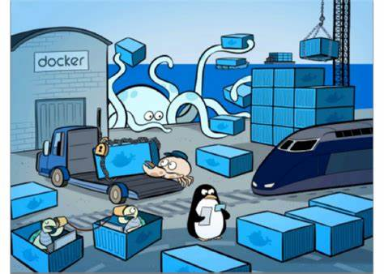
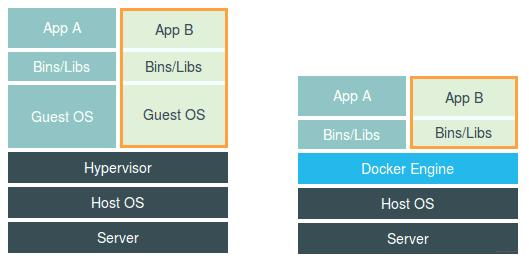
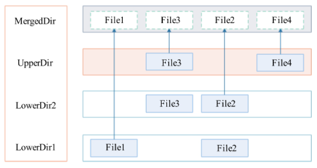
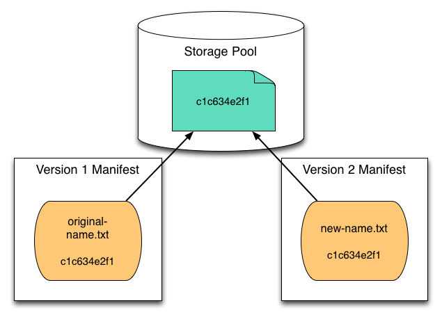
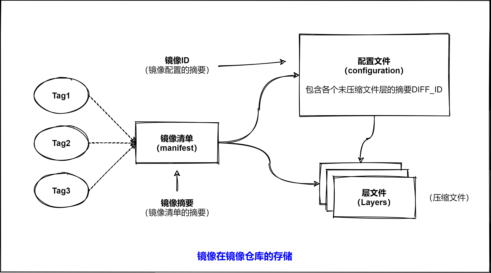
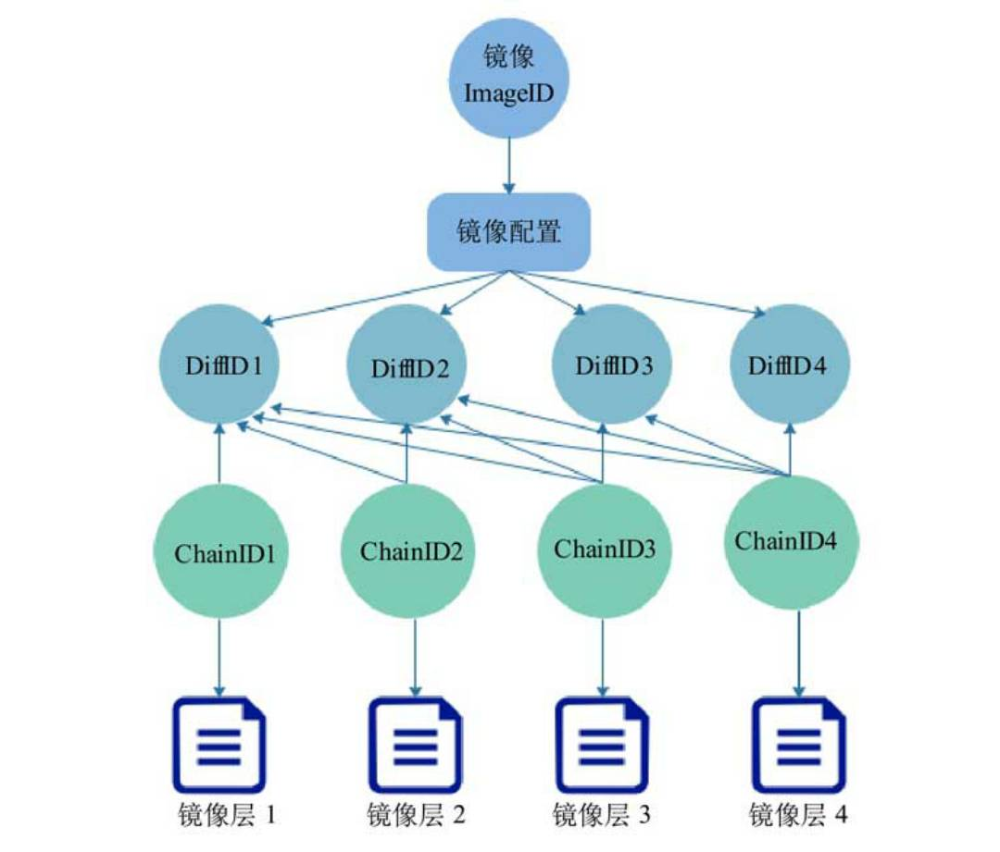
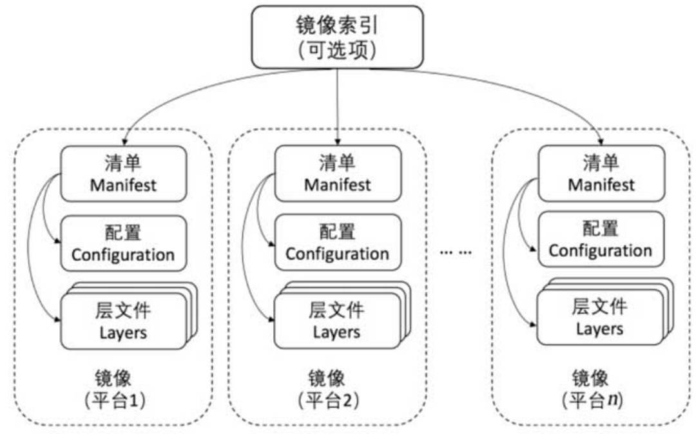
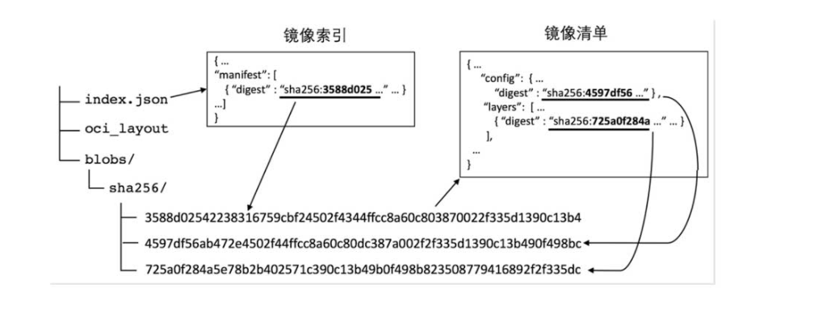

import { Highlight } from "@site/src/components/MyMDX"
import Tabs from '@theme/Tabs';
import TabItem from '@theme/TabItem';


## 镜像的发展历程

<Tabs>
  <TabItem value="2013年" label="2013年" default>

2013年，Docker推出容器管理工具，同时发布了封装应用的镜像。这是Docker与之前各种方案（如LXC）的重大区别，也是Docker得以胜出和迅速流传的主要原因。**可以说，镜像体现了Docker容器的核心价值**。由于历史原因，目前仍在使用的Docker镜像可能遵循了不同版本的镜像规范，因此在这简单介绍各个版本的镜像特点及相互关系，以便我们在实际应用中加以甄别。

  </TabItem>
  <TabItem value="2014年" label="2014年"> 

2014年，Docker把其镜像格式归纳和定义为Docker镜像规范`v1`。在这个规范中，镜像的每个层文件（`layer`）都包含一个存放元数据的`JSON`文件，并且用父ID来指明上一层镜像。这个规范有两个缺点：镜像的ID是随机生成的，可近似认为具有唯一性，可以用来标识镜像，但是用相同内容构建出来的层文件的ID并不一样，通过ID无法确认完全相同的层，不利于层的共享；每层都绑定了父层，紧耦合的结构不利于独立存放层文件。

  </TabItem>
  <TabItem value="2016年" label="2016年">

2016年，Docker制定了镜像规范`v2`，并在Docker `1.10`中实现了这个规范。镜像规范`v2`分为`Schema 1`和`Schema 2`。`Schema 1`主要兼容使用`v1`规范的Docker客户端，如Docker `1.9`及之前的客户端。`Schema 2`主要实现了两个功能：支持多体系架构的镜像和可通过内容寻址的镜像，其中最大的改进就是根据内容的`SHA256`摘要生成ID，只要内容相同，ID就是一样的，可区分相同的层文件（即可内容寻址）。`Schema 2`镜像的各层统一在`manifest.json`文件中描述，简化了分发和存储方面的流程。

  </TabItem>

  <TabItem value="2017年" label="2017年">

从2017年2月起，镜像规范`v1`不再被Registry支持，用户需要把已有的`v1`镜像转化为`v2`镜像才能推送到Registry中。`OCI`在2017年7月发布了`OCI`镜像规范`1.0`。因为Docker `v2`的镜像规范已经成为事实上的标准，`OCI`镜像规范实质上是以Docker镜像规范`v2`为基础制定的，**因此二者在绝大多数情况下是兼容或相似的**。如Docker镜像规范中的镜像索引（`image index`）和`OCI`镜像规范中的清单索引（`manifest index`）是等价的。

  </TabItem>

</Tabs>


:::note
所以，Docker镜像、OCI镜像、镜像，你可以把他们近似的看成一个东西
:::


## 什么是镜像

镜像是一个只读的容器模板，含有启动容器所需的文件系统结构及其内容，因此是启动一个容器的基础。镜像的文件内容以及一些运行容器的配置文件组成了容器的静态文件系统运行环境`rootfs`。

**可以这么理解，镜像是容器的静态视角，容器是镜像的运行状态。**



## 镜像背后的技术原理

为了更好的理解镜像的结构，我们还需要了解一下Docker容器镜像设计上的关键技术。

### rootfs

`rootfs`通常包含一个操作系统运行所需的文件系统，例如可能包含典型的类Unix操作系统中的目录系统，如`/dev`、`/proc`、`/bin`、`/etc`、`/lib`、`/usr`、`/tmp`及运行Docker容器所需的**配置文件**、工具等。

:::note
容器的rootfs是指容器在启动时内部进程可见的文件系统，即容器的根目录。
:::

另外，需要明确的是，`rootfs`只是一个操作系统所包含的文件、配置和目录，并不包括操作系统内核。在Linux操作系统中，这两部分是分开存放的，操作系统只有在开机启动时才会加载指定版本的内核镜像。所以，`rootfs`只包括操作系统的**躯壳**，并不包括操作系统的**灵魂**。

**那么，对于容器来说，这个操作系统的灵魂在哪呢？**

实际上，同一台机器上的所有容器都共享宿主机操作系统的内核。这就意味着，如果你的应用程序需要配置内核参数、加载额外的内核模块，以及跟内核进行直接交互，就需要注意了；这些操作和依赖的对象都是宿主机操作系统的内核，它对于该机器上的所有容器来说是一个**全局变量**，牵一发而动全身。这也是容器相比虚拟机的主要缺陷之一：毕竟后者不仅有模拟出来的硬件机器充当沙盒，而且每个沙盒里还运行着一个完整的客户操作系统供应用随便折腾。



### 分层结构

刚才我们说了`rootfs`技术，实现了容器打包操作系统的能力。但是随之而来的是一个非常棘手的问题：难道每开发一个镜像或对原有镜像进行升级，都需要从头制作一次`rootfs`吗？比如说用`Ubuntu`操作系统的ISO做了一个`rootfs`,并安装了Java环境，用来部署一个第一个Java应用，那么，我再发布第二个Java应用时，显然希望能够直接使用我安装过Java环境的`rootfs`，而不是重复这个流程。

一种比较直观的解决办法是，我在制作`rootfs`时，每做一步**有意义**的操作，就保存一个`rootfs`，这样每一步有意义的`rootfs`就能被按需使用，但是这个方法是不具推广性的。因为你一旦修改了这个`rootfs`，新旧两个`rootfs`就没有丝毫关系了。这会导致`rootfs`的极度碎片化，并难以管理维护！

那么，既然这些镜像都是基于一个旧的`rootfs`，我们能否以增量的方式去做这些修改呢？这样，所有人都只需要维护相对于**Base** rootfs修改的增量内容，而不是每次修改都能制造一个**fork**。

当然可以，这也正是Docker镜像的创新所在：Docker在镜像的设计中引入了层（layer）的概念。也就是说，用户制作镜像的每一步操作都会生成一个层，也就是一个增量的`rootfs`。**当然了，这个想法也不是Docker全新创造的，它也是利用一种叫做`UnionFS`（union file system，联合文件系统）的能力。**

镜像的layer被存放在了`/var/lib/docker/<storage-driver>/`目录下，这里的`storage-driver`可以有很多种如:`AUFS`、`OverlayFS`、`VFS`、`Brtfs`等。可以通过`docker info`命令查看存储驱动

```shell
docker info  -f '{{json .Driver}}'"overlay2"  # 证明我的是CentOS7.x
```

> 通常`Ubuntu`类的系统默认采用的是`AUFS`，`Centos7.1+`系列采用的是`OverlayFS`，这里来重点讲下后者。

### OverlayFS(联合挂载)

OverlayFS是一种堆叠文件系统，它依赖并建立在其它的文件系统之上（例如`ext4`、`xfs`等），并不直接参与磁盘空间结构的划分，**仅仅将原来底层文件系统中不同的目录进行“合并”**，然后向用户呈现，这也就是**联合挂载**技术，对比于AUFS，OverlayFS速度更快，实现更简单。而Linux 内核为Docker提供的OverlayFS驱动有两种：overlay和overlay2。而overlay2是相对于overlay的一种改进，在inode利用率方面比overlay更有效。但是overlay2有三点环境需求：

1.使用overlay2，Linux kernel版本必须高于`4.0`，在RHEL或者CentOS上Linux kernel版本高`3.10.0-514`
2.overlay2 在`docker-ce`中提供支持，`docker-ee`支持版本在 `17.06.02-ee5`及以上
3.overlay和overlay2存储驱动需要使用xfs后端文件系统，并且要设置 `d_type=true`

OverlayFS 由`LowerDir`、`UpperDir`和`MergedDir`组成，其中`LowerDir`可以有多个，对应容器文件系统的结构是只读层；`UpperDir` 是读写层，可以记录容器中的修改；`MergedDir`则是这些文件目录合并的结果，是容器最终挂载的文件目录，也是用户实际看到的文件目录，如下图所示：



**LowerDir文件的目录合并是有顺序的，LowerDir和UpperDir的目录合并也有先后关系。**

- LowerDir底层最先合并，然后是上层的LowerDir，最后是UpperDir。

- LowerDir1和LowerDir2都有File2文件，合并之后LowerDir2的File2文件覆盖LowerDir1的同名文件；
- 若UpperDir和LowerDir2中同时有File3文件，则合并之后UpperDir的File3文件覆盖LowerDir2的同名文件。
- 而LowerDir1中的File1文件因为没被上层覆盖，会被完全合并到最终的目录下。
- 所以合并之后，MergedDir中的文件如上图所示，这也是用户能看到的目录结构。
- 如果用户修改UpperDir中的文件，则会直接修改对应的文件；
- 如果用户尝试修改LowerDir中的文件，则会先在UpperDir中复制这个文件，然后在复制的文件中进行修改。

:::info
联合挂载是用于将多个镜像层的文件系统挂载到一个挂载点来实现一个统一文件系统视图的途径，是下层存储驱动（如aufs、overlay等）实现分层合并的方式。
所以严格来说，**联合挂载并不是Docker镜像的必需技术**，比如我们在使用DeviceMapper存储驱动时，其实是使用了快照技术来达到分层的效果，没有联合挂载这一概念。
:::

### 写时复制(COW)

Docker镜像使用了写时复制（copy-on-write）策略，在多个容器之间共享镜像，每个容器在启动的时候并不需要单独复制一份镜像文件，而是将所有镜像层以只读的方式挂载到一个挂载点，再在上面覆盖一个可读写的容器层。在未更改文件内容时，所有容器共享同一份数据，**只有在Docker容器运行过程中文件系统发生变化时，才会把变化的文件内容写到可读写层，并隐藏只读层中的老版本文件**。写时复制配合分层机制减少了镜像对磁盘空间的占用和容器启动时间。


### 内容寻址

在Docker 1.10版本后，Docker镜像改动较大，其中最重要的特性便是引入了内容寻址存储（content-addressable storage）的机制，根据文件内容来索引镜像和镜像层。

与之前版本对每一个镜像层随机生成一个UUID不同，新模型对镜像层的内容计算校验和，生成一个内容哈希值，并以此哈希值代替之前的UUID作为镜像层的唯一标志。该机制主要提高了镜像的安全性，并在`pull`、`push`、`load`和`save`操作后检测数据的完整性。另外，基于内容哈希来索引镜像层，在一定程度上减少了ID的冲突并且增强了镜像层的共享。对于来自不同构建的镜像层，只要拥有相同的内容哈希，也能被不同的镜像共享。



## 镜像的存储机制剖析

**刚才从技术实现上讲了Docker镜像，接下来将通过逐步深入的案例分析来理解镜像实现原理。**

### Docker镜像存储结构

Docker容器镜像的存储分为**本地存储**和**镜像仓库（Registry）存储**。镜像存储的本质还是分层存储，但是本地存储和镜像仓库存储的方式不完全一样，最大的区别是：

- 镜像仓库存储的核心是方便镜像快速上传和拉取，所以镜像存储使用了**压缩格式**，并且按照镜像层独立压缩和存储，然后使用镜像清单（manifest）包含所有的层，通过镜像摘要（digest）和Tag关联起来
- 镜像在本地存储的核心是快速加载和启动容器，镜像层存储是**非压缩**的（即源文件）。另外，容器在启动时需要将镜像层按照顺序堆叠作为容器的运行环境，所以镜像在本地存储中需要使用非压缩形式存放

在深入讲解镜像本地存储机制之前，我们先来拉取一个Docker镜像来简单理解下镜像在镜像仓库是如何存储的：

```
# docker pull debian:latest
latest: Pulling from library/debian
d960726af2be: Pull complete
Digest: sha256:acf7795dc91df17e10effee064bd229580a9c34213b4dba578d64768af5d8c51
Status: Downloaded newer image for debian:latest
docker.io/library/debian:latest
```

其中，`latest`是镜像的`Tag`，`sha256：acf77...5d8c51`是镜像的摘要，在支持Docker镜像规范v2 Schema 2的镜像仓库中，**二者都标识同一个镜像**。刚才我们也提到了，镜像摘要digest能和Tag关联起来，所以理论上我们也是可以通过digest来拉取指定镜像的指定版本的：

```
# docker pull debian@sha256:acf7795dc91df17e10effee064bd229580a9c34213b4dba578d64768af5d8c51
docker.io/library/debian@sha256:acf7795dc91df17e10effee064bd229580a9c34213b4dba578d64768af5d8c51: Pulling from library/debian
Digest: sha256:acf7795dc91df17e10effee064bd229580a9c34213b4dba578d64768af5d8c51
Status: Image is up to date for debian@sha256:acf7795dc91df17e10effee064bd229580a9c34213b4dba578d64768af5d8c51
docker.io/library/debian@sha256:acf7795dc91df17e10effee064bd229580a9c34213b4dba578d64768af5d8c51
```

> 镜像的`Tag` 主要用于对镜像赋予一定的标记，格式是`<repository>：<Tag>`，可以标识镜像的版本或其他信息。
>
> `Tag`在镜像仓库中可与镜像清单或者镜像索引关联，**多个`Tag`可以对应同一个镜像清单或镜像索引，由镜像仓库维护着它们的映射关系**。当客户端拉取镜像时，既可用Tag，也可用镜像摘要获取同样的镜像。

在镜像仓库上存储容器镜像的简化结构如下图所示，主要由三部分组成：清单文件（manifest）、镜像文件（configuration）和层文件（layers）。



刚才命令中的镜像摘要`digest`就是依据镜像清单文件内容计算`SHA256`哈希值而来的，在镜像清单文件中存放了配置文件的摘要和层文件的摘要，这些摘要都是通过具体的文件内容计算而来的，这也是我们上面讲到的内容寻址。这样做的好处是，除了可以唯一标识不同的文件，还可以在传输过程中通过摘要做文件校验。在文件下载完成后，计算所下载文件的摘要值，然后与下载时的摘要标识进行对比，如果二者一致，即可判断下载的文件是正确的。

```{warning}
由于文件在镜像仓库端是以压缩形式存放的，所以摘要值也是基于压缩文件计算而来的。
```

下面先来简单看下镜像清单(manifest)：

 ```

 # docker manifest inspect -v debian:latest
 [
         {
                 "Ref": "docker.io/library/debian:latest@sha256:3e24baa60967d085b95a45129f82af4eb9d1e33aff9559173542ebb15c5d9cb5",
                 "Descriptor": {
                         "mediaType": "application/vnd.docker.distribution.manifest.v2+json",
                         "digest": "sha256:3e24baa60967d085b95a45129f82af4eb9d1e33aff9559173542ebb15c5d9cb5",
                         "size": 529,
                         "platform": {
                                 "architecture": "amd64",
                                 "os": "linux"
                         }
                 },
                 "SchemaV2Manifest": {
                         "schemaVersion": 2,
                         "mediaType": "application/vnd.docker.distribution.manifest.v2+json",
                         "config": {
                                 "mediaType": "application/vnd.docker.container.image.v1+json",
                                 "size": 1463,
                                 "digest": "sha256:4a7a1f4017349067a21bd2de060dcf8b41e49fabf61b0dc3cf86a87e1f6dba9d"
                         },
                         "layers": [
                                 {
                                         "mediaType": "application/vnd.docker.image.rootfs.diff.tar.gzip",
                                         "size": 50433242,
                                         "digest": "sha256:d960726af2bec62a87ceb07182f7b94c47be03909077e23d8226658f80b47f87"
                                 }
 ]
                 }
         },
        ......
 ]
 ```

通过上面的`schemaVersion`我们可以知道使用的`Schema 2`规范，在镜像清单中包含一个配置文件（`config`属性）和1个层文件（`layers`属性）的引用信息，都是通过文件的摘要值`digest`来标识的。

在镜像清单中有个重要的概念---媒体类型（`mediaType`），在客户端下载镜像时，通过媒体类型可获得摘要所指向的文件类型，从而做出相应的处理。如`config`这里的媒体类型是`"application/vnd.docker.container.image.v1+json"`，可知摘要`sha256:4a7...a9d`引用的是配置文件，从而可以按照配置文件的格式来解析。

> 在docker镜像规范`v2 Schema 2`中还定义了适用于发布多平台支持的镜像索引，可指向同一组镜像适配不同平台的镜像清单（如`amd64`和`ppc64le`等），如上面这个例子中的[{"Descriptor"."platform"}]字段

下面的示例是Docker镜像配置文件(`config`)中关于`rootfs`的片段，包含了未压缩层文件的摘要(`DIFF_ID`)

```
"RootFS": {
            "Type": "layers",
            "Layers": [
                "sha256:688e187d6c79c46e8261890f0010fd5d178b8faa178959b0b46b2635aa1eeff3"
            ]
        }
```

> manifest 和 config都保存了镜像层的摘要信息，可以提前思考下为什么会这么设计？

### Docker镜像的本地存储结构

上面简单说了镜像在镜像仓库中的存储机制，接下来开始剖析Docker镜像在本地文件系统是如何存储的。

**Docker客户端从镜像仓库拉取一个镜像并存储到本地文件系统的过程大约如下：**

（1）向镜像仓库请求镜像的清单文件`manifest`。

（2）获取镜像`ID`（manifest中声明的config的digest），查看镜像`ID`是否在本地存在。

（3）若不存在，则下载配置文件`config`，在`config`文件中含有每个层文件未压缩的文件摘要`DIFF_ID`。

（4）检查层文件是否在本地存在，若不存在，则从镜像仓库中拉取每一层的压缩文件。

（5）拉取时，使用镜像清单中压缩层文件的摘要作为内容寻址下载。

（6）下载完一层的文件后，解压并按照摘要校验。

（7）当所有层文件都拉取完毕时，镜像就下载完成了。

我们依旧还是以`debian:latest`为例：

```
# docker images debian:latest
REPOSITORY   TAG       IMAGE ID       CREATED       SIZE
debian       latest    4a7a1f401734   5 weeks ago   114MB
```

在IMAGE ID（镜像ID）列显示的`4a7a1f401734` 是本地镜像的唯一标识ID，可以在“docker”命令中使用。这个ID和镜像仓库中镜像摘要`sha256:3e2...cb5`的形式类似，但是数值不一样，**这是因为该ID是镜像配置文件的摘要**，**所以和镜像仓库使用的清单文件摘要不同。**

**那么为什么要使用配置文件的摘要作为IMAGE ID而不是使用镜像清单文件的摘要？**

使用配置文件的摘要作为本地镜像的标识，主要是因为本地镜像存放的文件都是非压缩的文件，而镜像仓库存放的是压缩文件，因此层文件在本地和镜像仓库中有不同的摘要值。因为压缩文件的内容会受到压缩算法等因素的影响，所以同样内容的层无法保证压缩后摘要的唯一性，而镜像清单文件包含压缩层文件的摘要（参考上文示例），因此通过镜像清单文件的摘要（即镜像摘要）无法确定镜像的唯一性。配置文件则不同，其中包含的层信息是未压缩的摘要值，因此相同镜像的各层内容必然相同，配置文件的摘要值是唯一确定的。

另外，在本地存储镜像时，镜像的存储格式和其使用方式息息相关。镜像是按照堆叠目录存放的，堆叠目录的存放是从底层开始，上一层的标识会由下面所有层的`DIFF_ID`计算而来，这个计算而来的标识叫作`CHAIN_ID`，计算公式如下：

```
CHAIN_ID<n> = sha256sum( DIFF_ID<n> DIFF_ID<n-1> DIFF_ID<n-2> ... DIFF_IF1)
```

> 计算`CHAIN_ID`标识的好处是，在镜像实际使用过程中，镜像层之间都是有关联的，所以通过这个标识可以快速知道当前镜像层及**所有**依赖层是否一致，避免仅仅镜像层一致但依赖层不一致的问题，也保证了镜像的有效性。

本地存储的镜像结构如下图所示。



## OCI镜像规范

> 刚才我们了解了Docker镜像的发展和底层设计，虽然Docker镜像V2已经近似为OCI镜像标准，但是后期要切换到Containerd。
>
> ​    **所以接下来再了解下OCI镜像规范。**

`OCI`镜像规范是以Docker镜像规范`v2`为基础制定的，它定义了镜像的主要格式及内容，主要用于镜像仓库存放镜像及分发镜像等场景。`OCI`运行时在创建容器前，要把镜像下载并解压成符合运行时规范的文件系统包，并且把镜像中的配置转化成运行时配置，然后启动容器。


OCI 定义的镜像包括4个部分：**镜像索引（Image Index）、清单（Manifest）、配置（Configuration）和层文件（Layers）**。其中：

- 清单是JSON格式的描述文件，列出了镜像的配置和层文件。
- 配置是JSON格式的描述文件，说明了镜像运行的参数。
- 层文件则是镜像的内容，即镜像包含的文件，一般是二进制数据文件格式（`Blob`）。一个镜像可以有一个或多个层文件。
- 镜像索引不是必需的，如果存在，则指明了一组支持不同架构平台的相关镜像。

镜像的4个部分之间是通过摘要（`digest`）来相互引用（`reference`）的。镜像各部分的关系如下图所示：



下面详细讲解各部分的结构和作用。

### 1. 镜像索引

**镜像索引是镜像中可选择的部分，一个镜像可以不包括镜像索引。**

如果镜像包含了镜像索引，则其作用主要指向镜像不同平台的版本，代表一组同名且相关的镜像，差别只在支持的体系架构上（如`i386`和`arm64v8`、`Linux`和`Windows`等）。索引的优点是在不同的平台上使用镜像的命令无须修改，如在`amd64`架构的Windows和`ARM`架构的Linux上，采用同样的docker命令即可运行Nginx服务(而不需要指定特定的平台)：

-

```
# docker run -d nginx
```

> 用户无须指定操作系统和平台，就可完全依赖客户端获取正确版本的镜像。OCI的索引已经被CNAB等工具广泛用来管理与云平台无关的分布式应用程序。

下面是一个索引示例：

```

{
  "schemaVersion": 2,
  "manifests": [
    {
      "mediaType": "application/vnd.oci.image.manifest.v1+json",
      "size": 7143,
      "digest": "sha256:e692418e4cbaf90ca69d05a66403747baa33ee08806650b51fab815ad7fc331f",
      "platform": {
        "architecture": "ppc64le",
        "os": "linux"
      }
    },
    {
      "mediaType": "application/vnd.oci.image.manifest.v1+json",
      "size": 7682,
      "digest": "sha256:5b0bcabd1ed22e9fb1310cf6c2dec7cdef19f0ad69efa1f392e94a4333501270",
      "platform": {
        "architecture": "amd64",
        "os": "linux"
      }
    }
  ],
  "annotations": {
    "com.example.key1": "value1",
    "com.example.key2": "value2"
  }
}
```

以上示例中主要属性的意义如下。

- schemaVersion：必须是`2`，主要用于兼容旧版本的Docker。
- manifests：清单数组，在上面的例子中含有两个清单，每个清单都代表某个平台上的镜像。`mediaType`指媒体类型，其值为`application/vnd.oci.image.manifest.v1+json`时，表明是清单文件。`size`指清单文件的大小。`digest`指清单文件的摘要。`platform`指镜像所支持的平台，包括CPU架构和操作系统。
- annotations：键值对形式的附加信息（可选项）。

客户端在获得上述镜像索引后，解析后可发现该索引指向两个不同平台架构的镜像，因此可根据自身所在的平台拉取相应的镜像。如Linux amd64平台上的客户端会拉取第2个镜像，因为该镜像的`platform.architecture`属性为`amd64`，`platform.os`属性为`Linux`。

索引文件中的`mediaType`和`digest`属性是`OCI`镜像规范中的重要概念，下面详细讲解这两个属性。

（1）`mediaType`属性是描述镜像所包含的各种文件的媒体属性，客户端从Registry等服务中下载镜像文件时，可从`HTTP`的头部属性`Content-Type`中获得下载文件的媒体类型，从而决定如何处理下载的文件。比如，镜像的索引和清单都是JSON格式的文件，它们的区别就是媒体类型不同。

OCI镜像规范定义的媒体类型见下表，可以看到上面例子中的清单的媒体类型是`application/vnd.oci.image.manifest.v1+json`，索引本身的媒体类型则是`application/vnd.oci.image.index.v1+json`。

| 媒体类型                                                     | 含义                                |
| ------------------------------------------------------------ | ----------------------------------- |
| application/vnd.oci.descriptor.v1+json                       | 内容描述符                          |
| application/vnd.oci.layout.header.v1+json                    | OCI布局规范                         |
| application/vnd.oci.image.index.v1+json                      | 镜像索引                            |
| application/vnd.oci.image.manifest.v1+json                   | 镜像清单                            |
| application/vnd.oci.image.config.v1+json                     | 镜像配置                            |
| application/vnd.oci.image.layer.v1.tar                       | tar格式的层文件                     |
| application/vnd.oci.image.layer.v1.tar+gzip                  | tar格式的层文件，采用gzip压缩       |
| application/vnd.oci.image.layer.v1.tar+zstd                  | tar格式的层文件，采用zstd压缩       |
| application/vnd.oci.image.layer.nondistributable.v1.tar      | tar格式的非分发层文件               |
| application/vnd.oci.image.layer.nondistributable.v1.tar+zip  | tar格式的非分发层文件，采用gzip压缩 |
| application/vnd.oci.image.layer.nondistributable.v1.tar+zstd | tar格式的非分发层文件，采用zstd压缩 |

（2）`digest`属性是密码学意义上的摘要，充当镜像内容的标识符，实现内容的可寻址（content addressable）。`OCI`镜像规范中镜像的内容（如文件等）大多是通过摘要来标识和引用的。

摘要的生成是根据文件内容的二进制字节数据通过特定的哈希（`Hash`）算法实现的。哈希算法需要确保字节的抗冲突性（`collision resistant`）来生成唯一标识，只要哈希算法得当，不同文件的哈希值几乎不会重复，如`SHA256`算法发生冲突的概率大约只有`1/2^256`。因此，**可以近似地认为每个文件的摘要都是唯一的**。这种唯一性使摘要可以作为内容寻址的标识。同时，如果摘要以安全的方式传递，则接收方可以通过重新计算摘要来确保内容在传输过程中未被修改，从而杜绝来自不安全来源的内容。在`OCI`的镜像规范中也要求用摘要值校验所接收的内容。

摘要值是由算法和编码两部分组成的字符串，算法部分指定使用的哈希函数和算法标识，编码部分则包含哈希函数的编码结果，具体格式为`<算法标识> ：<编码结果>`。

> 目前OCI镜像规范认可的哈希算法有两种，分别是`SHA-256`和`SHA-512`

### 2.镜像清单

镜像清单（简称清单）是说明镜像包含的配置和内容的文件，分析镜像一般从镜像清单开始。镜像清单主要有三个作用：支持内容可寻址的镜像模型，在该模型中可以对镜像的配置进行哈希处理，以生成镜像及其唯一标识；通过镜像索引包含多体系结构镜像，通过引用镜像清单获取特定平台的镜像版本；可转换为OCI运行时规范以运行容器。

镜像清单主要包括配置和层文件的信息，示例如下：

```
{
  "schemaVersion": 2,
  "config": {
    "mediaType": "application/vnd.oci.image.config.v1+json",
    "size": 7023,
    "digest": "sha256:b5b2b2c507a0944348e0303114d8d93aaaa081732b86451d9bce1f432a537bc7"
  },
  "layers": [
    {
      "mediaType": "application/vnd.oci.image.layer.v1.tar+gzip",
      "size": 32654,
      "digest": "sha256:9834876dcfb05cb167a5c24953eba58c4ac89b1adf57f28f2f9d09af107ee8f0"
    },
    {
      "mediaType": "application/vnd.oci.image.layer.v1.tar+gzip",
      "size": 16724,
      "digest": "sha256:3c3a4604a545cdc127456d94e421cd355bca5b528f4a9c1905b15da2eb4a4c6b"
    },
    {
      "mediaType": "application/vnd.oci.image.layer.v1.tar+gzip",
      "size": 73109,
      "digest": "sha256:ec4b8955958665577945c89419d1af06b5f7636b4ac3da7f12184802ad867736"
    }
  ],
  "annotations": {
    "com.example.key1": "value1",
    "com.example.key2": "value2"
  }
  }
```

其中主要属性的意义如下：

- schemaVersion：必须是`2`，主要用于兼容旧版本的Docker。
- config：镜像配置文件的信息。mediaType的值`application/vnd.oci.image.config.v1+json`表示镜像配置的媒体类型。`size`指镜像配置文件的大小。`digest`指镜像配置文件的哈希摘要。
- layers：层文件数组。在以上示例中包含3个层文件，分别代表容器根文件系统的一个层。容器在运行时，会把各个层文件依次按顺序叠加，第1层在底层。mediaType指媒体类型，其值`application/vnd.oci.image.layer.v1.tar+gzip`表示层文件。`size`指层文件的大小。`digest`指层文件的摘要。
- annotations：键值对形式的附加信息（可选项）。

### 3.镜像配置

镜像配置主要描述容器的根文件系统和容器运行时使用的执行参数，还有一些镜像的元数据。

在配置规范里定义了镜像的文件系统的组成方式。镜像文件系统由若干镜像层组成，每一层都代表一组`tar`格式的层格式，除了底层（`base image`），其余各层的文件系统都记录了其父层（向下一层）文件系统的变化集（`changeset`），包括要添加、更改或删除的文件。

通过基于层的文件、联合文件系统（如`AUFS`）或文件系统快照的差异，文件系统的变化集可用于聚合一系列镜像层，使各层叠加后仿佛是一个完整的文件系统。

下面是镜像配置的一个示例：

 ```

 {
     "created": "2015-10-31T22:22:56.015925234Z",
     "author": "Alyssa P. Hacker <alyspdev@example.com>",
     "architecture": "amd64",
     "os": "linux",
     "config": {
         "User": "alice",
         "ExposedPorts": {
             "8080/tcp": {}
         },
         "Env": [
             "PATH=/usr/local/sbin:/usr/local/bin:/usr/sbin:/usr/bin:/sbin:/bin",
             "FOO=oci_is_a",
             "BAR=well_written_spec"
         ],
         "Entrypoint": [
             "/bin/my-app-binary"
         ],
         "Cmd": [
             "--foreground",
             "--config",
             "/etc/my-app.d/default.cfg"
         ],
         "Volumes": {
             "/var/job-result-data": {},
             "/var/log/my-app-logs": {}
         },
         "WorkingDir": "/home/alice",
         "Labels": {
             "com.example.project.git.url": "https://example.com/project.git",
             "com.example.project.git.commit": "45a939b2999782a3f005621a8d0f29aa387e1d6b"
         }
     },
     "rootfs": {
       "diff_ids": [
         "sha256:c6f988f4874bb0add23a778f753c65efe992244e148a1d2ec2a8b664fb66bbd1",
         "sha256:5f70bf18a086007016e948b04aed3b82103a36bea41755b6cddfaf10ace3c6ef"
       ],
       "type": "layers"
     },
     "history": [
       {
         "created": "2015-10-31T22:22:54.690851953Z",
         "created_by": "/bin/sh -c #(nop) ADD file:a3bc1e842b69636f9df5256c49c5374fb4eef1e281fe3f282c65fb853ee171c5 in /"
       },
       {
         "created": "2015-10-31T22:22:55.613815829Z",
         "created_by": "/bin/sh -c #(nop) CMD [\"sh\"]",
         "empty_layer": true
       }
     ]
 }
 ```

其中主要属性的意义如下，具体说明可以参考OCI规范。

- created：镜像的创建时间（可选项）。
- author：镜像的作者（可选项）。
- architecture：镜像支持的CPU架构。
- os：镜像的操作系统。
- config：镜像运行的一些参数，包括服务端口、环境变量、入口命令、命令参数、数据卷、用户和工作目录等（可选项）
- rootfs：镜像的根文件系统，由一系列层文件的变化集组成。
- history：镜像每层的历史信息（可选项）。

### 4.层文件

在镜像清单和配置信息中可以看到，镜像的根文件系统由多个层文件叠加而成。每个层文件在分发时都必须被打包成一个`tar`文件，可选择压缩或者非压缩的方式，压缩工具可以是`gzip`或者`zstd`。把每层的内容打包为一个文件的好处是除了发布方便，还可以生成文件摘要，便于**校验和按内容寻址**。

> 在镜像清单和配置信息里面需要根据`tar`文件是否压缩和压缩工具等信息声明媒体类型，使镜像客户端可以识别文件类型并进行相应的处理。

每个层文件都包含了对上一层（父层）的更改，包括**增加、修改和删除**文件三种操作类型，底层（第1层）可以被看作对空层文件的增加。因此在每个`tar`文件里面除了该层的文件，还可以包含对上一层中文件的删除操作，用`whiteout`的方式标记。在叠加层文件时，可以根据whiteout[2]的标记，把上一层删除的文件在本层屏蔽。

在镜像索引小节中的表格中，还有几个层文件的媒体类型为**不可分发**（`non-distributable`），这是为了说明该层文件因为法律等原因无法公开分发，需要从分发商那里获得该层文件。

### 5.镜像的文件布局

前面介绍了OCI镜像内容的组成部分，接下来将具体讲解这些组成部分在实际文件系统中的布局和关联关系。OCI定义的镜像文件和目录结构如下所示。

```
$ cd example.com/app/
$ find . -type f
./index.json
./oci-layout
./blobs/sha256/3588d02542238316759cbf24502f4344ffcc8a60c803870022f335d1390c13b4
./blobs/sha256/4b0bc1c4050b03c95ef2a8e36e25feac42fd31283e8c30b3ee5df6b043155d3c
./blobs/sha256/7968321274dc6b6171697c33df7815310468e694ac5be0ec03ff053bb135e768
```

- 在镜像的根目录下必须有JSON格式的`index.json`文件，作为镜像索引。

- 在同一目录下必须有一个JSON格式的`oci_layout`文件，作为OCI格式的标记和OCI镜像规范版本说明。该文件的媒体类型为`application/vnd.oci.layout.header.v1+json`，表示布局文件。该文件的内容如下：

    ```
    {     
    	"imageLayoutVersion"："1.0.0"
    }
    ```

- 必须存在blobs目录，但该目录可以为**空**。在该目录下，按照摘要哈希算法的标识生成子目录，并存放用该算法寻址（查找）的内容。如果内容的摘要是`<算法标识> ：<编码结果>`，那么该内容的哈希必须等于`编码结果`，并且存放于这个路径的文件名中：`blobs/<算法标识>/<编码结果>`

> 这样的布局方法使根据内容的摘要很容易找到内容的实际文件，即按内容寻址。

**下图为镜像文件布局之间的引用关系，我们可以更加形象的进行理解。**


