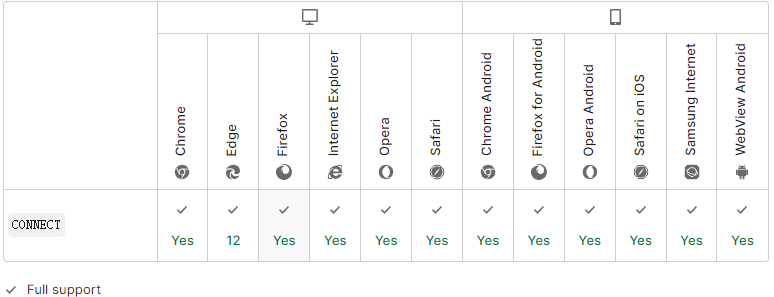

import { Highlight } from "@site/src/components/MyMDX"
import Tabs from '@theme/Tabs';
import TabItem from '@theme/TabItem';

  
&nbsp;
 <br/>  
&nbsp;
<br />

在 HTTP 协议中，**`CONNECT`** 方法可以开启一个客户端与所请求资源之间的双向沟通的通道。它可以用来创建隧道（tunnel）。

例如，**`CONNECT`** 可以用来访问采用了 [SSL](https://developer.mozilla.org/zh-CN/docs/Glossary/SSL) ([HTTPS](https://developer.mozilla.org/zh-CN/docs/Glossary/https)) 协议的站点。客户端要求代理服务器将 TCP 连接作为通往目的主机隧道。之后该服务器会代替客户端与目的主机建立连接。连接建立好之后，代理服务器会面向客户端发送或接收 TCP 消息流。

`CONNECT` 是一个应用范围为点到点的方法。

| Request has body                                             | No   |
| :----------------------------------------------------------- | ---- |
| Successful response has body                                 | Yes  |
| [Safe](https://developer.mozilla.org/zh-CN/docs/Glossary/Safe) | No   |
| [Idempotent](https://developer.mozilla.org/zh-CN/docs/Glossary/Idempotent) | No   |
| [Cacheable (en-US)](https://developer.mozilla.org/en-US/docs/Glossary/cacheable) | No   |
| Allowed in [HTML forms](https://developer.mozilla.org/en-US/docs/Learn/Forms) | No   |

### 语法

```
CONNECT www.example.com:443 HTTP/1.1
```

### 示例

一些代理服务器在创建隧道时会要求进行身份验证。参见 `Proxy-Authorization` 首部。

```html
CONNECT server.example.com:80 HTTP/1.1
Host: server.example.com:80
Proxy-Authorization: basic aGVsbG86d29ybGQ=
```

### 规范

| Specification                                                | Title                                                        |
| :----------------------------------------------------------- | :----------------------------------------------------------- |
| [RFC 7231, section 4.3.6: CONNECT](https://datatracker.ietf.org/doc/html/rfc7231#section-4.3.6) | Hypertext Transfer Protocol (HTTP/1.1): Semantics and Content |

### 浏览器兼容性

[Report problems with this compatibility data on GitHub](https://github.com/mdn/browser-compat-data/issues/new?mdn-url=https%3A%2F%2Fdeveloper.mozilla.org%2Fzh-CN%2Fdocs%2FWeb%2FHTTP%2FMethods%2FCONNECT&metadata= MDN+page+report+details<%2Fsummary> *+Query%3A+`http.methods.CONNECT` *+Report+started%3A+2022-07-22T09%3A22%3A00.370Z <%2Fdetails>&title=http.methods.CONNECT+-+&template=data-problem.yml)


