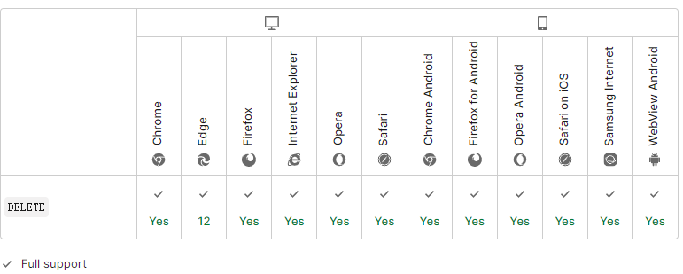

import { Highlight } from "@site/src/components/MyMDX"
import Tabs from '@theme/Tabs';
import TabItem from '@theme/TabItem';

  
&nbsp;
 <br/>  
&nbsp;
<br />

**HTTP DELETE** 请求方法用于删除指定的资源。

| 请求是否有主体                                               | 可以有 |
| :----------------------------------------------------------- | ------ |
| 成功的返回是否有主体                                         | 可以有 |
| 安全                                                         | 否     |
| [幂等](https://developer.mozilla.org/zh-CN/docs/Glossary/Idempotent) | 是     |
| 可缓存                                                       | 否     |
| 可以在[HTML forms](https://developer.mozilla.org/en-US/docs/Learn/Forms)中使用 | 否     |

## 语法

```
DELETE /file.html HTTP/1.1
```

## 示例

### 请求

```
DELETE /file.html HTTP/1.1
```

### 响应

如果 `DELETE `方法成功执行，那么可能会有以下几种状态码：

-   状态码 [`202`](https://developer.mozilla.org/zh-CN/docs/Web/HTTP/Status/202) (`Accepted`) 表示请求的操作可能会成功执行，但是尚未开始执行。
-   状态码 [`204`](https://developer.mozilla.org/zh-CN/docs/Web/HTTP/Status/204) (`No Content`) 表示操作已执行，但是无进一步的相关信息。
-   状态码 [`200`](https://developer.mozilla.org/zh-CN/docs/Web/HTTP/Status/200) (`OK`) 表示操作已执行，并且响应中提供了相关状态的描述信息。

```
HTTP/1.1 200 OK
Date: Wed, 21 Oct 2015 07:28:00 GMT

<html>
  <body>
    <h1>File deleted.</h1>
  </body>
</html>
```

## 规范

| Specification                                                | Title                                                        |
| :----------------------------------------------------------- | :----------------------------------------------------------- |
| [RFC 7231, section 4.3.5: DELETE](https://datatracker.ietf.org/doc/html/rfc7231#section-4.3.5) | Hypertext Transfer Protocol (HTTP/1.1): Semantics and Content |

## Browser compatibility

[Report problems with this compatibility data on GitHub](https://github.com/mdn/browser-compat-data/issues/new?mdn-url=https%3A%2F%2Fdeveloper.mozilla.org%2Fzh-CN%2Fdocs%2FWeb%2FHTTP%2FMethods%2FDELETE&metadata= MDN+page+report+details<%2Fsummary> *+Query%3A+`http.methods.DELETE` *+Report+started%3A+2022-07-22T09%3A34%3A59.194Z <%2Fdetails>&title=http.methods.DELETE+-+&template=data-problem.yml)

