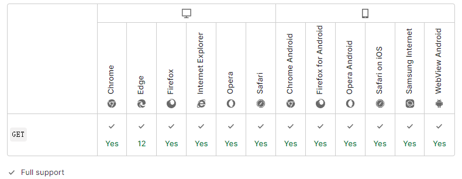

import { Highlight } from "@site/src/components/MyMDX"
import Tabs from '@theme/Tabs';
import TabItem from '@theme/TabItem';

  
&nbsp;
 <br/>  
&nbsp;
<br />

**HTTP` GET` 方法**请求指定的资源。使用 `GET` 的请求应该只用于获取数据。

| 请求是否有主体                                               | 否   |
| :----------------------------------------------------------- | ---- |
| 成功的响应是否有主体                                         | 是   |
| 安全                                                         | 是   |
| [幂等](https://developer.mozilla.org/zh-CN/docs/Glossary/Idempotent) | 是   |
| 可缓存                                                       | 是   |
| HTML 表单是否支持                                            | 是   |

## 语法

```
GET /index.html
```

## 规范

| 规范                                                         | 标题                                                         |
| :----------------------------------------------------------- | :----------------------------------------------------------- |
| [RFC 7231, section 4.3.1: GET](https://datatracker.ietf.org/doc/html/rfc7231#section-4.3.1) | Hypertext Transfer Protocol (HTTP/1.1): Semantics and Content |

## 浏览器兼容性

[Report problems with this compatibility data on GitHub](https://github.com/mdn/browser-compat-data/issues/new?mdn-url=https%3A%2F%2Fdeveloper.mozilla.org%2Fzh-CN%2Fdocs%2FWeb%2FHTTP%2FMethods%2FGET&metadata= MDN+page+report+details<%2Fsummary> *+Query%3A+`http.methods.GET` *+Report+started%3A+2022-07-22T09%3A38%3A59.149Z <%2Fdetails>&title=http.methods.GET+-+&template=data-problem.yml)

