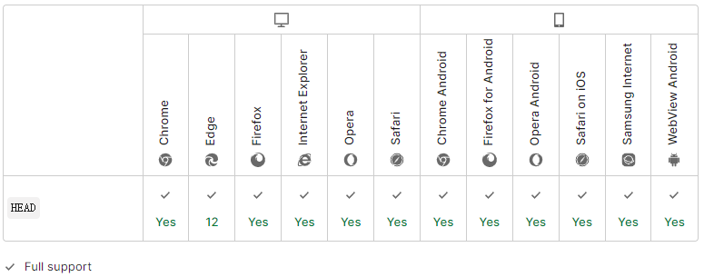

import { Highlight } from "@site/src/components/MyMDX"
import Tabs from '@theme/Tabs';
import TabItem from '@theme/TabItem';

  
&nbsp;
 <br/>  
&nbsp;
<br />


**HTTP `HEAD` 方法** 请求资源的头部信息，并且这些头部与 HTTP [`GET`](https://developer.mozilla.org/zh-CN/docs/Web/HTTP/Methods/GET) 方法请求时返回的一致。该请求方法的一个使用场景是在下载一个大文件前先获取其大小再决定是否要下载，以此可以节约带宽资源。

`HEAD` 方法的响应不应包含响应正文。即使包含了正文也必须忽略掉. 虽然描述正文信息的 [entity headers](https://developer.mozilla.org/zh-CN/docs/Glossary/Entity_header), 例如 [`Content-Length`](https://developer.mozilla.org/zh-CN/docs/Web/HTTP/Headers/Content-Length) 可能会包含在响应中，但它们并不是用来描述 `HEAD` 响应本身的，而是用来描述同样情况下的 [`GET`](https://developer.mozilla.org/zh-CN/docs/Web/HTTP/Methods/GET) 请求应该返回的响应。

如果 `HEAD` 请求的结果显示在上一次 [`GET`](https://developer.mozilla.org/zh-CN/docs/Web/HTTP/Methods/GET) 请求后缓存的资源已经过期了，即使没有发出[`GET`](https://developer.mozilla.org/zh-CN/docs/Web/HTTP/Methods/GET)请求，缓存也会失效

| 请求是否有正文                                               | 否   |
| :----------------------------------------------------------- | ---- |
| 成功的响应是否有正文                                         | 否   |
| 安全                                                         | 是   |
| [幂等](https://developer.mozilla.org/zh-CN/docs/Glossary/Idempotent) | 是   |
| 可缓存                                                       | 是   |
| [HTML 表单](https://developer.mozilla.org/en-US/docs/Learn/Forms) 是否支持 | 否   |


## 语法

```
HEAD /index.html
```

## 规范

| 规范                                                         | 标题                                                         |
| :----------------------------------------------------------- | :----------------------------------------------------------- |
| [RFC 7231, section 4.3.2: HEAD](https://datatracker.ietf.org/doc/html/rfc7231#section-4.3.2) | Hypertext Transfer Protocol (HTTP/1.1): Semantics and Content |

## 浏览器兼容性

[Report problems with this compatibility data on GitHub](https://github.com/mdn/browser-compat-data/issues/new?mdn-url=https%3A%2F%2Fdeveloper.mozilla.org%2Fzh-CN%2Fdocs%2FWeb%2FHTTP%2FMethods%2FGET&metadata= MDN+page+report+details<%2Fsummary> *+Query%3A+`http.methods.GET` *+Report+started%3A+2022-07-22T09%3A38%3A59.149Z <%2Fdetails>&title=http.methods.GET+-+&template=data-problem.yml)

