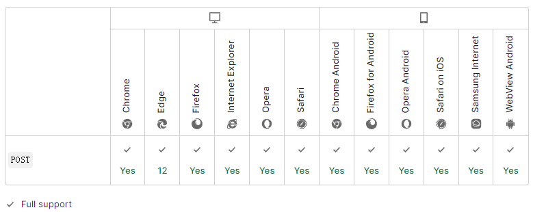

import { Highlight } from "@site/src/components/MyMDX"
import Tabs from '@theme/Tabs';
import TabItem from '@theme/TabItem';

  
&nbsp
<br/>  
&nbsp
<br />

**HTTP `POST` 方法** 发送数据给服务器。请求主体的类型由 [`Content-Type`](https://developer.mozilla.org/zh-CN/docs/Web/HTTP/Headers/Content-Type) 首部指定。

PUT 和[`POST`](https://developer.mozilla.org/zh-CN/docs/Web/HTTP/Methods/POST)方法的区别是，PUT 方法是幂等的：连续调用一次或者多次的效果相同（无副作用）。连续调用同一个 POST 可能会带来额外的影响，比如多次提交订单。

一个 `POST` 请求通常是通过 [HTML 表单](https://developer.mozilla.org/en-US/docs/Learn/Forms)发送，并返回服务器的修改结果。在这种情况下，content type 是通过在 [``](https://developer.mozilla.org/zh-CN/docs/Web/HTML/Element/form) 元素中设置正确的 [`enctype`](https://developer.mozilla.org/zh-CN/docs/Web/HTML/Element/form#attr-enctype) 属性，或是在 [``](https://developer.mozilla.org/zh-CN/docs/Web/HTML/Element/Input) 和 [``](https://developer.mozilla.org/zh-CN/docs/Web/HTML/Element/button) 元素中设置 [`formenctype`](https://developer.mozilla.org/zh-CN/docs/Web/HTML/Element/Input#attr-formenctype) 属性来选择的:

-   `application/``x-www-form-urlencoded`: 数据被编码成以 `'&'` 分隔的键 - 值对，同时以 `'='` 分隔键和值。非字母或数字的字符会被 [percent-encoding](https://developer.mozilla.org/zh-CN/docs/Glossary/percent-encoding): 这也就是为什么这种类型不支持二进制数据 (应使用 `multipart/form-data` 代替).
-   `multipart/form-data`
-   `text/plain`

当 POST 请求是通过除 HTML 表单之外的方式发送时，例如使用 [`XMLHttpRequest`](https://developer.mozilla.org/zh-CN/docs/Web/API/XMLHttpRequest), 那么请求主体可以是任何类型。按 HTTP 1.1 规范中描述，POST 为了以统一的方法来涵盖以下功能：

-   注释已有的资源
-   在公告板，新闻组，邮件列表或类似的文章组中发布消息;
-   通过注册新增用户;
-   向数据处理程序提供一批数据，例如提交一个表单;
-   通过追加操作，扩展数据库数据。

| 请求是否有主体                                               | 是                                        |
| :----------------------------------------------------------- | ----------------------------------------- |
| 成功的响应是否有主体                                         | 是                                        |
| 安全                                                         | 否                                        |
| [幂等](https://developer.mozilla.org/zh-CN/docs/Glossary/Idempotent) | 否                                        |
| 可缓存                                                       | Only if freshness information is included |
| HTML 表单是否支持                                            | 是                                        |

## 语法

```
POST /index.html
```

## 示例

使用默认的 `application/x-www-form-urlencoded` 做为 content type 的简单表单：

```html
POST / HTTP/1.1
Host: foo.com
Content-Type: application/x-www-form-urlencoded
Content-Length: 13

say=Hi&to=Mom
```

使用 `multipart/form-data` 作为 content type 的表单：

```
POST /test.html HTTP/1.1
Host: example.org
Content-Type: multipart/form-data;boundary="boundary"

--boundary
Content-Disposition: form-data; name="field1"

value1
--boundary
Content-Disposition: form-data; name="field2"; filename="example.txt"

value2
```

## 规范

| 规范                                                         | 标题                                                         |
| :----------------------------------------------------------- | :----------------------------------------------------------- |
| [RFC 7231, section 4.3.3: POST](https://datatracker.ietf.org/doc/html/rfc7231#section-4.3.3) | Hypertext Transfer Protocol (HTTP/1.1): Semantics and Content |

## 浏览器兼容性

[Report problems with this compatibility data on GitHub](https://github.com/mdn/browser-compat-data/issues/new?mdn-url=https%3A%2F%2Fdeveloper.mozilla.org%2Fzh-CN%2Fdocs%2FWeb%2FHTTP%2FMethods%2FPOST&metadata= MDN+page+report+details<%2Fsummary> *+Query%3A+`http.methods.POST` *+Report+started%3A+2022-07-22T09%3A50%3A19.198Z <%2Fdetails>&title=http.methods.POST+-+&template=data-problem.yml)

