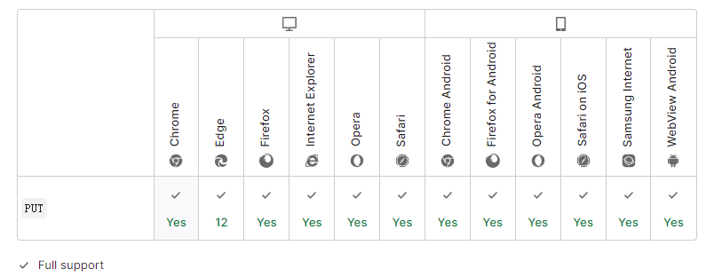

import { Highlight } from "@site/src/components/MyMDX"
import Tabs from '@theme/Tabs';
import TabItem from '@theme/TabItem';

  
&nbsp
<br/>  
&nbsp
<br />

**HTTP PUT 请求方法**使用请求中的负载创建或者替换目标资源。

`PUT` 与 [`POST`](https://developer.mozilla.org/zh-CN/docs/Web/HTTP/Methods/POST) 方法的区别在于，PUT 方法是幂等的：调用一次与连续调用多次是等价的（即没有副作用），而连续调用多次 POST 方法可能会有副作用，比如将一个订单重复提交多次。

| Request has body                                             | Yes  |
| :----------------------------------------------------------- | ---- |
| Successful response has body                                 | No   |
| [Safe](https://developer.mozilla.org/zh-CN/docs/Glossary/Safe) | No   |
| [Idempotent](https://developer.mozilla.org/zh-CN/docs/Glossary/Idempotent) | Yes  |
| [Cacheable (en-US)](https://developer.mozilla.org/en-US/docs/Glossary/cacheable) | No   |
| Allowed in [HTML forms](https://developer.mozilla.org/en-US/docs/Learn/Forms) | No   |

## 语法

```
PUT /new.html HTTP/1.1
```

## 示例

### 请求

```
PUT /new.html HTTP/1.1
Host: example.com
Content-type: text/html
Content-length: 16

<p>New File</p>
```

### 应答

如果目标资源不存在，并且 PUT 方法成功创建了一份，那么源头服务器必须返回[`201`](https://developer.mozilla.org/zh-CN/docs/Web/HTTP/Status/201) (`Created`) 来通知客户端资源已创建。

```
HTTP/1.1 201 Created
Content-Location: /new.html
```

如果目标资源已经存在，并且依照请求中封装的表现形式成功进行了更新，那么，源头服务器必须返回[`200`](https://developer.mozilla.org/zh-CN/docs/Web/HTTP/Status/200) (`OK`) 或者[`204`](https://developer.mozilla.org/zh-CN/docs/Web/HTTP/Status/204) (`No Content`) 来表示请求的成功完成。

```
HTTP/1.1 204 No Content
Content-Location: /existing.html
```

## 规范

| Specification                                                | Title                                                        |
| :----------------------------------------------------------- | :----------------------------------------------------------- |
| [RFC 7231, section 4.3.4: PUT](https://datatracker.ietf.org/doc/html/rfc7231#section-4.3.4) | Hypertext Transfer Protocol (HTTP/1.1): Semantics and Content |

## 浏览器兼容性

[Report problems with this compatibility data on GitHub](https://github.com/mdn/browser-compat-data/issues/new?mdn-url=https%3A%2F%2Fdeveloper.mozilla.org%2Fzh-CN%2Fdocs%2FWeb%2FHTTP%2FMethods%2FPUT&metadata= MDN+page+report+details<%2Fsummary> *+Query%3A+`http.methods.PUT` *+Report+started%3A+2022-07-22T09%3A53%3A26.185Z <%2Fdetails>&title=http.methods.PUT+-+&template=data-problem.yml)

