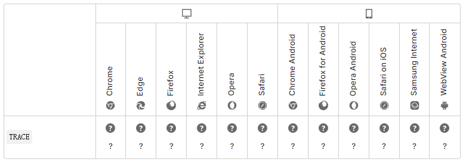

import { Highlight } from "@site/src/components/MyMDX"
import Tabs from '@theme/Tabs';
import TabItem from '@theme/TabItem';

  
&nbsp
<br/>  
&nbsp
<br />

**HTTP `TRACE` 方法** 实现沿通向目标资源的路径的消息环回（loop-back）测试 ，提供了一种实用的 debug 机制。

请求的最终接收者应当原样反射（reflect）它接收到的消息，除了以下字段部分，作为一个[`Content-Type`](https://developer.mozilla.org/zh-CN/docs/Web/HTTP/Headers/Content-Type) 为 `message/http` 的 200（OK）响应的消息的主体（body）返回给客户端 。

最终接收者是指初始（origin）服务器，或者第一个接收到 [`Max-Forwards`](https://developer.mozilla.org/zh-CN/docs/Web/HTTP/Headers/Max-Forwards) 值为 0 的请求的服务器。

| 有主体（body）的请求（request）                              | 否   |
| :----------------------------------------------------------- | ---- |
| 包含主体（body）的成功的响应（response）                     | 否   |
| [Safe](https://developer.mozilla.org/zh-CN/docs/Glossary/Safe) | 否   |
| [Idempotent](https://developer.mozilla.org/zh-CN/docs/Glossary/Idempotent) | 是   |
| [Cacheable (en-US)](https://developer.mozilla.org/en-US/docs/Glossary/cacheable) | 否   |
| 允许用于 HTML 表单（form）                                   | 否   |

## 语法

```
TRACE /index.html
```

## 规范

| 规范                                                         | 标题                                                         |
| :----------------------------------------------------------- | :----------------------------------------------------------- |
| [RFC 7231, section 4.3.8: TRACE](https://datatracker.ietf.org/doc/html/rfc7231#section-4.3.8) | Hypertext Transfer Protocol (HTTP/1.1): Semantics and Content |

## 浏览器兼容性

[Report problems with this compatibility data on GitHub](https://github.com/mdn/browser-compat-data/issues/new?mdn-url=https%3A%2F%2Fdeveloper.mozilla.org%2Fzh-CN%2Fdocs%2FWeb%2FHTTP%2FMethods%2FTRACE&metadata= MDN+page+report+details<%2Fsummary> *+Query%3A+`http.methods.TRACE` *+Report+started%3A+2022-07-22T09%3A54%3A17.464Z <%2Fdetails>&title=http.methods.TRACE+-+&template=data-problem.yml)

